# Diagram catalog

Every diagram in a design document should answer a question someone actually asked.
A diagram that exists because the template had a slot for it costs review attention and
goes stale unread. Pick the view, state the question it answers in one line above it,
and leave the rest out.

## Contents

1. [Choosing the view](#1-choosing-the-view)
2. [System context](#2-system-context)
3. [Container and component views](#3-container-and-component-views)
4. [Sequence](#4-sequence)
5. [Deployment and networking](#5-deployment-and-networking)
6. [Class and domain model](#6-class-and-domain-model)
7. [Data model (ERD)](#7-data-model-erd)
8. [State machine](#8-state-machine)
8b. [Data-flow and trust boundaries](#8b-data-flow-and-trust-boundaries)
8c. [Dependency and capability maps](#8c-dependency-and-capability-maps)
9. [Mermaid pitfalls](#9-mermaid-pitfalls)
10. [House style](#10-house-style)

---

## 1. Choosing the view

| The question being asked | The view that answers it |
|---|---|
| Who uses this and what does it talk to? | System context |
| What are the deployable pieces and how do they communicate? | Container view |
| What is inside this one service? | Component view |
| How does this scenario actually play out over time? | Sequence |
| Where does it run, and what can reach what? | Deployment / network |
| Where does sensitive data go, and what boundaries does it cross? | Data-flow diagram |
| What does an attacker see, and where does trust change? | Trust boundary diagram |
| What depends on what, and where is the risky coupling? | Dependency map |
| What business capabilities exist, and which are we building? | Capability map |
| How do we get from today's architecture to the target? | Transition diagram (`references/evolution.md`) |
| What are the core domain concepts and their rules? | Class / domain model |
| How is the data structured and related? | ERD |
| What states can this thing be in, and what moves it? | State machine |

Most projects need a context view, one container view, and two or three sequences for
the risky flows. Add the rest only when a real question demands it. For a small project,
one container view plus one sequence is often the whole diagram budget — and that is fine.

Sequences earn their place on the flows where something can go wrong: the ones that
cross a trust boundary, span services, involve money, or have a failure path someone
will have to implement. A sequence of a CRUD read is a waste of a page.

---

## 2. System context

Answers: who are the users, what external systems do we depend on, what is inside our
boundary? Draw exactly one box for "our system" — resisting the urge to decompose here is
the entire value of this view.

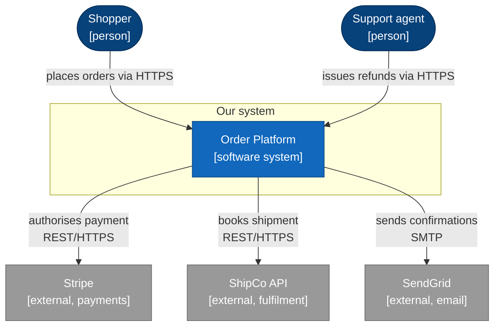

Label every arrow with **what flows and over what protocol**. An unlabelled arrow between
two boxes communicates almost nothing, and reviewers cannot tell a synchronous HTTP call
from a nightly file drop.

---

## 3. Container and component views

Answers: what are the separately deployable/runnable things, what technology is each,
and how do they talk? This is the view most teams get the most value from, so if only
one diagram survives, make it this one.

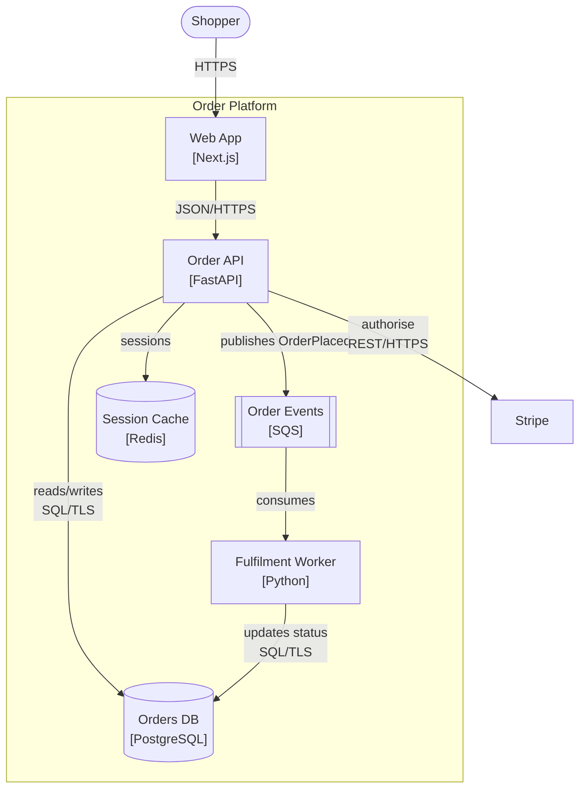

Shape carries meaning and saves a legend: `[ ]` process/service, `[( )]` datastore,
`[[ ]]` queue or topic, `([ ])` person or actor. Put the technology choice in the box —
"Order API [FastAPI]" tells a new engineer more in three words than a paragraph will.

A **component view** is the same notation pointed inside one container. Draw it only for
the container with real internal complexity, and say which container it is decomposing.

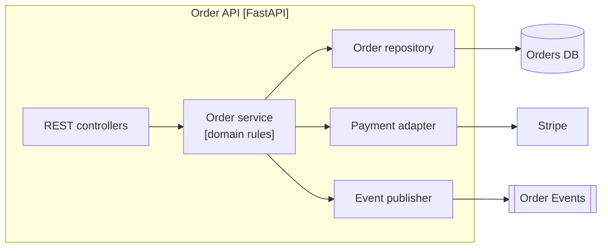

---

## 4. Sequence

Answers: in what order does this scenario happen, who waits for whom, and what happens
when a step fails? Name the scenario in the caption and tie it to the story it comes from
(for example "US-014 — place an order with a saved card").

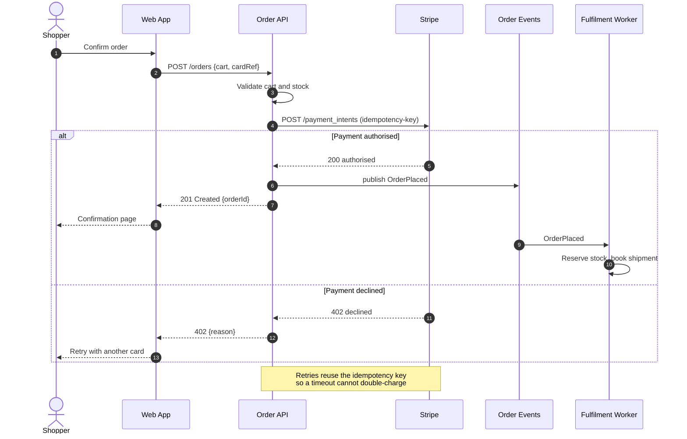

The failure branch is the part worth drawing. A happy-path-only sequence hides exactly the
decisions the team will argue about in code review. Use `alt/else` for genuine branches,
`opt` for a step that sometimes happens, `loop` for retries or polling, and a `Note` to
record the rule that makes the interaction safe.

Dashed arrows (`-->>`) are responses; solid (`->>`) are requests. `-)` marks a fire-and-forget
async send, which is worth using when the distinction matters to the design.

---

## 5. Deployment and networking

Answers: where does each thing run, what network boundaries exist, and what is allowed to
reach what? This view is what a security reviewer reads first, so make trust boundaries
visible rather than implied.

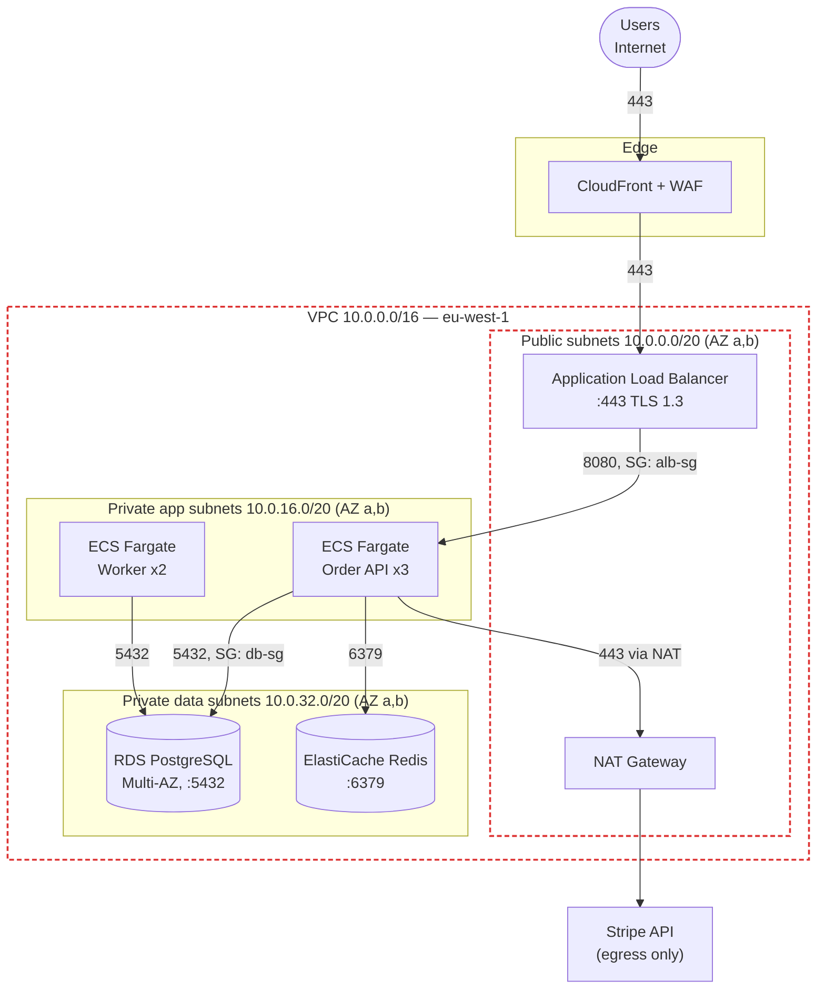

Include the things that cause outages and audit findings: ports, CIDR ranges, TLS
termination points, availability zones, and which security group or firewall rule permits
each arrow. "ECS → RDS" is a picture; "ECS → RDS :5432, SG db-sg allows app-sg only" is a
design someone can implement and review.

---

## 6. Class and domain model

Answers: what are the core concepts, what do they own, and what rules bind them? Model the
domain, not every DTO. If the diagram has more than about fifteen classes, it has stopped
being a communication tool.

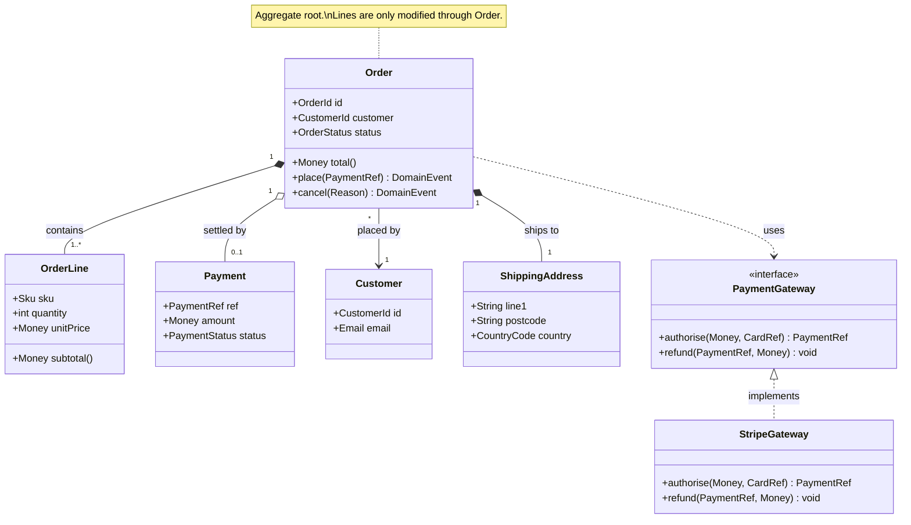

Composition (`*--`) means the part cannot exist without the whole — it is the notation that
tells a reader where the transactional boundary is, so use it deliberately rather than
defaulting every line to a plain association. Mark interfaces with `<<interface>>` and use
a note to record the invariant that the code must protect.

---

## 7. Data model (ERD)

Answers: what is persisted, with what keys and cardinality? Use this rather than a class
diagram when the conversation is about storage, migrations, or reporting.

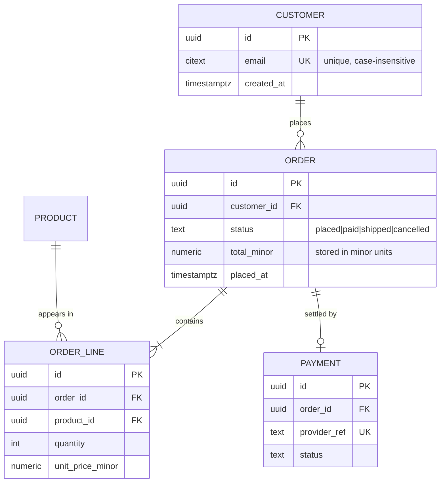

Cardinality reads left-to-right: `||--o{` is one-to-many-optional, `||--|{` is
one-to-many-mandatory, `}o--o{` is many-to-many. Mark `PK`, `FK`, `UK` and put the
constraint that will bite in the comment column — currency handling, soft deletes,
and uniqueness rules are where data models go wrong.

---

## 8. State machine

Answers: what states does this entity have, what events move it, and which transitions are
forbidden? Worth drawing whenever a story says "cannot be cancelled once shipped" or
similar, because that sentence is a transition table in disguise.

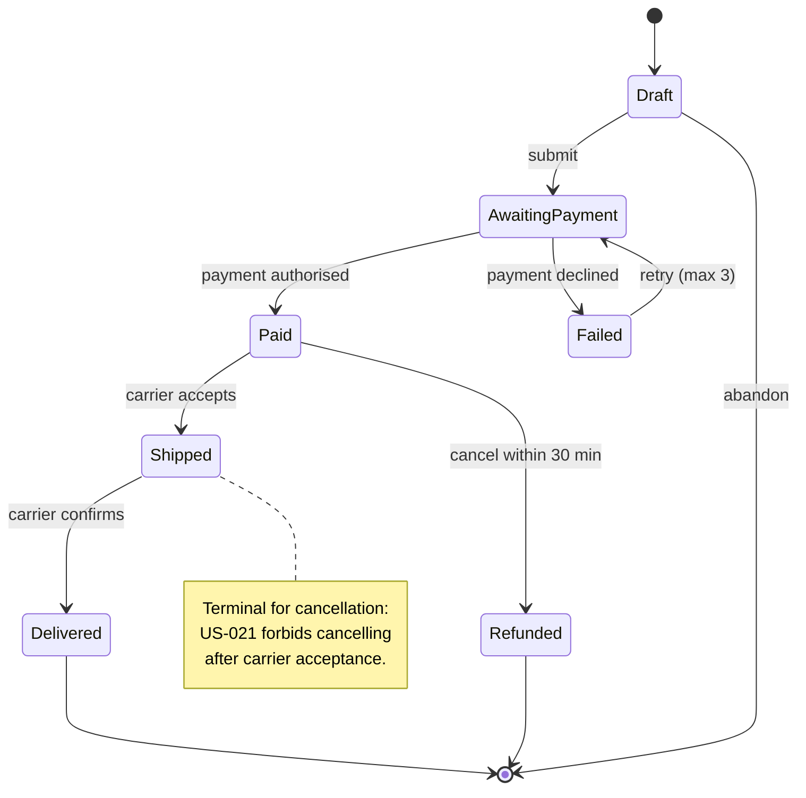

---

## 8b. Data-flow and trust boundaries

Answers: where does sensitive data actually go, and what changes trust along the way? This is
the view a threat model is built on, because threats follow data rather than deployment units
— which is why a component diagram is a poor substitute here.

Show the data, classified, and mark every boundary crossing. The crossings are the rows in
the STRIDE analysis (`references/security.md`).

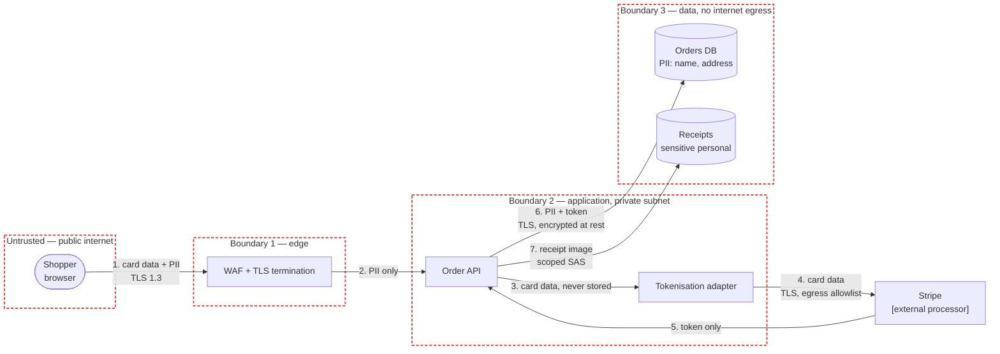

Number the flows so the threat model can reference them (`flow 3 — tampering — mitigated by
…`). Say what data is in each flow and its classification; "sends request" tells a security
reviewer nothing.

## 8c. Dependency and capability maps

A **dependency map** answers: what depends on what, and where is the coupling that will hurt?
Use it when there are enough components that the container view no longer makes the coupling
obvious, and mark the direction of the dependency rather than the direction of data flow —
they are often opposite, and it is the dependency direction that constrains change.

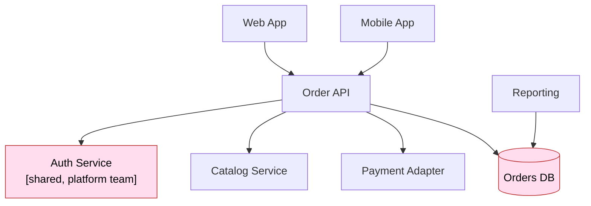

Highlight the risky nodes: shared datastores written by more than one component, single
points of failure, and components owned by another team whose release schedule you do not
control. Those are the entries that belong in the risk register.

A **capability map** answers: what does the business do, and which parts are we building,
buying, or leaving alone? It is useful in early scoping conversations with stakeholders who
do not think in components.

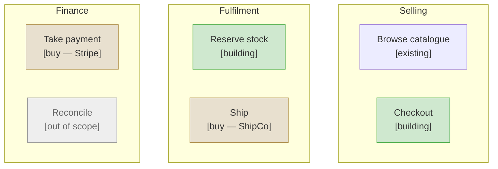

Marking scope on a capability map is a quick way to surface disagreement about what is being
built, which is much cheaper to discover here than after the container view is drawn.

## 9. Mermaid pitfalls

These are the errors that actually happen. Running `scripts/render_diagrams.py --check`
catches all of them in a couple of seconds, which is cheaper than shipping a document
whose diagrams show as raw text on GitHub.

| Problem | Fix |
|---|---|
| Parentheses, colons, commas, or slashes in a label break the parse | Quote the label: `A["Order API (v2)"]` |
| Need a line break in a label | ` ` inside a quoted label; real newlines break it |
| `end` as a node name or label word | Quote it, or rename — `end` closes a subgraph |
| Subgraph title differs from the id you reference | Use `subgraph id["Title"]` and reference `id` |
| Edge label with special characters | `A -->|"reads/writes"| B` — quote inside the pipes |
| Arrow into or out of a `subgraph` behaves oddly | Point at a node inside it; edges to subgraph ids are unreliable |
| Mermaid's `C4Context` diagram type | Avoid — still experimental and layouts poorly. Use `flowchart` with C4 conventions and `classDef`, as in section 2 |
| Very wide diagram is unreadable | Switch `flowchart LR` ↔ `TB`, or split into two views |
| Reserved words as node ids (`graph`, `class`, `click`, `style`, `default`, `o`, `x`) | Prefix the id, e.g. `svcClass` |
| A `%%` comment on the same line as syntax | Comments need their own line |
| Semicolon inside a sequence message or node label | `;` ends a statement — use a comma, or quote the label |
| `#` inside a label | Escape as `&num;` or quote the label |

---

## 9b. Layout that stays readable

A diagram that parses is not necessarily a diagram anyone can read. Mermaid lays edge
labels out automatically, and in a dense flowchart they collide and overlap into
unreadable fragments. Parsing is checked by the script; legibility is only checked by
looking at the rendered image, so look at one before shipping the document.

What reliably keeps a container view readable:

- **Short edge labels.** Put the protocol on the arrow (`SQL/TLS`, `JSON/HTTPS`,
  `SAS upload`) and the fuller explanation in the container table underneath. Two long
  labels on adjacent edges is the most common cause of overlap.
- **Actors and external systems outside the subgraph**, with `flowchart LR` at the top
  level and `direction TB` inside it. Users flow in from the left, dependencies exit to
  the right, and internals stack vertically.
- **Around seven boxes per diagram.** Past that, decompose: one container view plus a
  component view of the busy container beats one crowded diagram.
- **Avoid crossing edges** by ordering nodes in the direction things actually flow.

If two labels still overlap after that, shorten them further or split the view. Do not
leave a rendered diagram in a document with fragments of text sitting on top of each other
— reviewers read it as carelessness and discount the rest of the document.

## 10. House style

Consistency across the document is what lets a reader carry meaning from one diagram to
the next without re-learning the notation:

- **Same name everywhere.** If the container view says "Order API", the sequence diagram
  says "Order API" — not "OrderSvc". Names should match the code and the ADRs too.
- **Label the arrows.** What flows, in what direction, over what protocol.
- **One question per diagram**, stated in the sentence above it.
- **Colour by role, not decoration**, via `classDef`: internal, external, datastore,
  trust boundary. Keep the same palette across all diagrams in a document.
- **Cite the driver.** Where a diagram exists because of a story or requirement, mention
  the ID in the caption — it is what keeps design and backlog honest with each other.
- **Left to right for flow, top to bottom for layers.** Sequences read down, deployments
  read down through network tiers, pipelines read across.
