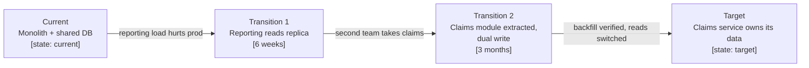

# Evolution, migration, cost and lifecycle

Almost nothing is greenfield, and almost every design contains choices that are right for
now and wrong later. This reference covers making that explicit rather than accidental.

---

## 1. Current, target, and transition states

Keep them as **separate artifacts**, each with `state:` in its frontmatter. Blending them
produces a document that describes nothing that exists: engineers reading it cannot tell
which boxes are real, and reviewers cannot tell what is being proposed.

- **Current state** — what exists today, including the parts nobody likes. Written honestly;
  a sanitised current state makes the migration plan wrong.
- **Target state** — where this is going, with the drivers that justify it.
- **Transition states** — the intermediate architectures the system genuinely passes
  through. Each one has to work in production, sometimes for months, so it deserves the same
  scrutiny as the target.

The transition is usually harder than either end state, and the parallel-run period is where
the real cost and risk sit. A target architecture with no transition plan is a wish.

Label each arrow with the **trigger** that justifies moving, not just the work involved.
Movement without a trigger is how teams end up mid-migration indefinitely, carrying the cost
of both architectures and the benefits of neither.

## 2. Transitional decisions

A transitional decision is a deliberate compromise with a known expiry: SQLite until
concurrency demands otherwise, a manual process until volume justifies automation, a shared
database until a second team owns the module.

These are good decisions — they defer cost until it is warranted. They become bad only when
the expiry is unrecorded. So every transitional decision carries:

| Field | Example |
|---|---|
| **Trigger** | More than one writer process, or database above 5 GB, or 2027-06-01 — whichever first |
| **Compatibility strategy** | Standard SQL only, no SQLite-specific features; repository interface isolates access |
| **Migration outline** | Dump, transform, load; verified by row counts and checksums; ~2h downtime acceptable |
| **Cost of deferral** | Migration effort roughly doubles if it happens after the reporting feature ships |
| **Owner and review date** | platform-lead, review 2027-01-15 |

Record it as an ADR with `state: transition` and a `review_trigger`.
`scripts/check_freshness.py` raises it when the date passes — which is the mechanism that
stops "we'll move to PostgreSQL later" from silently becoming the permanent architecture.

## 3. Migration and legacy retirement

Plan these explicitly, because each is a place where migrations stall:

- **Data migration** — how data moves, how it is transformed, and how correctness is
  *verified* (row counts, checksums, reconciliation reports, sampled manual review). "We ran
  the script" is not verification.
- **Parallel running** — will both systems run at once? Who is authoritative meanwhile? Who
  reconciles differences, how often, and what happens when they disagree? Parallel running is
  expensive and frequently under-planned.
- **Cutover** — big bang, phased by capability, phased by user group, or strangler-fig
  routing at the edge. Each has a different rollback story; say what rollback means after
  users have created data in the new system, since that is usually the point of no return.
- **Backward compatibility** — for APIs, data formats, and clients that update on their own
  schedule. State how long old versions are supported.
- **Retirement** — the step that gets funded last and skipped most. Name the date the legacy
  system is switched off, who confirms nothing still depends on it, what happens to its data
  (export, archive, delete), and who cancels the licences and the infrastructure.

An unretired legacy system costs money and attention indefinitely, and its continued
existence quietly undermines the case for the migration that was supposed to replace it.

## 4. Technical debt register

Deliberate compromises are worth recording; forgotten ones become mysteries.

| ID | Debt | Taken because | Cost of carrying | Trigger to repay | Owner |
|---|---|---|---|---|---|
| TD-01 | Claims module reads payroll tables directly | Launch deadline | Blocks payroll schema change | Before payroll v2 | Claims lead |

Distinguish **deliberate debt** (a decision, with an ADR) from **discovered debt** (found
later, needs a decision). Prioritise by the cost of carrying it and by what it blocks, not by
how unpleasant it looks. Debt that blocks nothing and is not spreading can often be left
alone, and saying so protects the credibility of the items that do matter.

## 5. Designing for anticipated change

Modularity is worth paying for exactly where change is expected, and wasted everywhere else.
So ask what is *known* to be coming — a regulatory change, a second market, a vendor whose
contract expires, a scale threshold — and put the seam there.

Resist generalising for changes nobody has named. Speculative flexibility has a real cost
(indirection, configuration, more test surface) and it is usually aimed at the wrong axis;
the change that actually arrives is rarely the one the abstraction anticipated.

## 6. Cost, licensing, sustainability

**What drives the bill** matters more than today's total. Identify the unit that scales:
per request, per stored GB, per seat, per egress GB, per environment. Unit economics that
only break at scale are invisible until they are expensive.

| Driver | Unit cost | At current volume | At 10× |
|---|---|---|---|
| Blob storage | $0.02/GB/mo | ~$4/mo | ~$40/mo |
| Per-seat licence | $12/user/mo | $480/mo | $4,800/mo |
| Egress | $0.09/GB | ~$9/mo | ~$90/mo |

Note where non-production environments dominate cost — frequently they do, and it is
frequently the easiest saving available.

**Licensing** applies to software and to data. Check for terms that restrict commercial use,
redistribution, or model training on the data; copyleft obligations in bundled dependencies;
and per-core or per-instance licensing that interacts badly with autoscaling.

**Lock-in** is a trade, not a sin. Record where it is accepted deliberately and what
switching would actually cost — an adapter boundary and a documented export path are usually
worth building; full portability usually is not.

**Close the loop:** state how actual cost will be compared against these assumptions —
budget alerts, a monthly review, tagging by component. An estimate nobody checks against
reality is decoration.

## 7. Lifecycle and end of life

For the system itself, not just its dependencies: what is the upgrade path for consumers,
how is deprecation communicated, how do customers export their data, and what happens at
retirement. Systems that outlive their teams are the norm rather than the exception, so
writing this down is a kindness to people who are not in the room.

## 8. Artifacts these domains produce

Current-state architecture, target-state architecture, transition architectures, migration
plan (`assets/migration-plan-template.md`), compatibility plan, technical-debt register, cost
model, licensing inventory, and decommissioning plan. Select against risk — see
`references/artifact-selection.md`.
