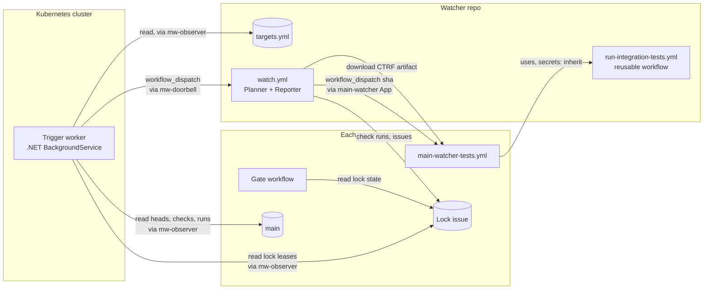
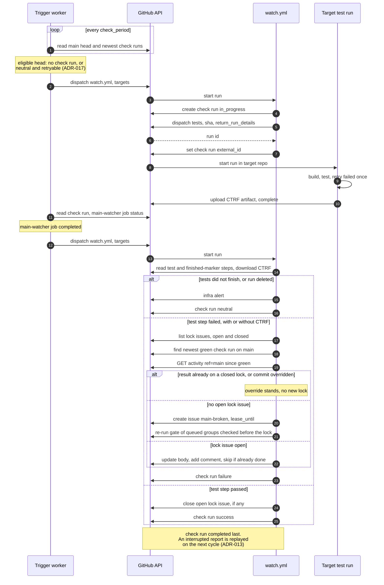
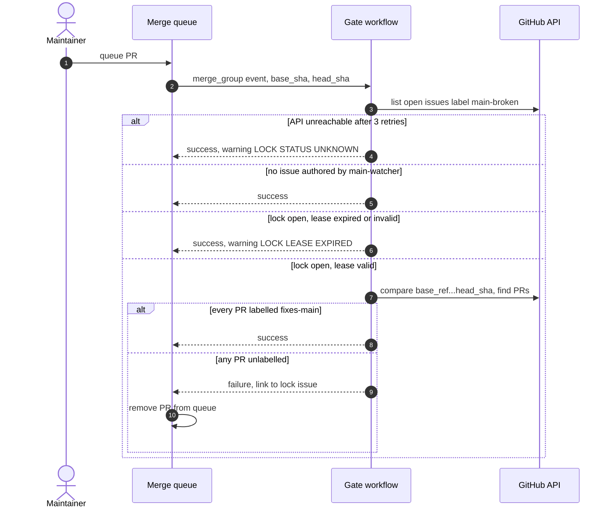
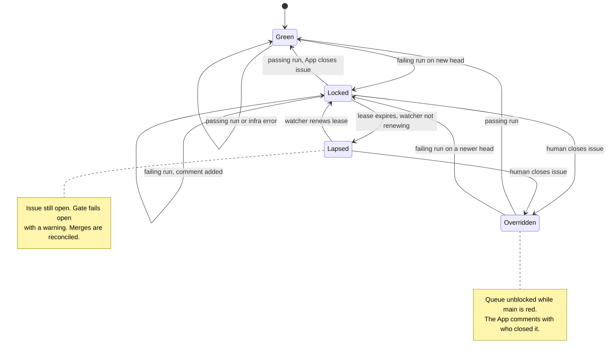
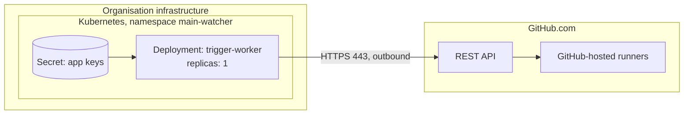

# Main Watcher — Architecture

## Confirmation queue

These items started as defaults chosen during design. The requester settled CQ-1 to CQ-9
on 2026-09-15. CQ-10 to CQ-14 came from adversarial reviews of the architecture on the
same day, and the requester confirmed all of them as proposed.

| # | Item | Section | Why it matters | Settled by |
|---|---|---|---|---|
| CQ-1 | Each target has a configurable `poll_interval` (default 15 min): the minimum time between test starts. The worker checks for changes every `check_period` (default 60 s). Confirmed | 2, 5.1 | Detection time vs. test load | Requester |
| CQ-2 | All target repos live in the watcher's GitHub organisation. Confirmed | 8, 10 | One installation per App | Requester |
| CQ-3 | Each target repo manages its own test secrets, its own way. Confirmed; this became FR-5 and ADR-009 | 8 | Who controls test credentials | Requester |
| CQ-4 | Failed tests are retried once before a failure counts. Confirmed | 5.1 | Flaky tests would otherwise lock the queue | Requester |
| CQ-5 | Setup, checkout and timeout errors alert, but do **not** lock the queue. Confirmed | 5.1, 11 | Watcher faults must not block teams | Requester |
| CQ-6 | The issue @-mentions owners only: `notify` in `targets.yml`, else the `*` owners in CODEOWNERS. Confirmed | 5.1 | Notification noise | Requester |
| CQ-7 | The gate fails **open** on API errors; the watcher reports it afterwards (ADR-008). Confirmed | 5.2, 11 | Merge availability | Requester |
| CQ-8 | The platform team owns the watcher repo, the trigger worker and all three GitHub Apps. Confirmed | 14 | Key custody | Requester |
| CQ-9 | Anyone with triage rights may apply `fixes-main`. Confirmed | 8, R-4 | The lock bypass | Requester |
| CQ-10 | The Reporter writes the lock issue before completing the check run, and replays an interrupted report without re-locking a commit a human overrode; a "reporting pending" alert after 15 min. The test outcome comes from the `main-watcher-test` step (build and tests), so a failure stays red without CTRF; checkout and restore failures, and tests that do not finish (deadline, timeout, cancellation), are infrastructure errors; a test run that waits over 30 min for a runner, or overruns its job timeout, is cancelled and its steps read before it is judged (ADR-013). Confirmed | 5.1 | A crash or a failed upload must not leave a red `main` unlocked, and a replay must not undo an override | Requester |
| CQ-11 | A lock lapses when the watcher has not renewed it for `lock_lease` (default 4 h), and the gate then fails open with a warning. With a lock open, NFR-3 therefore holds only after up to `lock_lease`. `mw-observer` gains Issues: read (ADR-014). Confirmed | 5.2, 8 | Merge availability vs. enforcing a red `main` through a long watcher outage | Requester |
| CQ-12 | Reconciliation continues after a lock closes, until merges up to its closure are checked; closures older than 30 days are not revisited; each merge is judged by the PR's labels at merge time (ADR-015). Confirmed | 5.2 | NFR-4 must hold when a human closes the lock first, or a label changes after the merge | Requester |
| CQ-13 | When a lock opens, or a lapsed lock is renewed, the watcher re-runs the gate for merge groups still in the queue whose gate started earlier. FR-4 is narrowed: a group that merges in the seconds before its re-run takes effect is reported, not blocked (ADR-016). Confirmed | 2, 5.2 | Otherwise groups that passed the gate just before a lock merge onto a red `main`, with no outage involved | Requester |
| CQ-14 | A head whose newest result is `neutral` is tested again once `poll_interval` has passed, up to 3 neutral results per head; after that, a "head untestable" alert, and a push or a forced dispatch is needed (ADR-017). Confirmed | 5.1 | A setup failure must not leave `main` untested, and a lock wrongly open or closed | Requester |

---

## 1. Overview

Main Watcher is a reusable component that continuously runs a repository's .NET/xUnit v3
integration tests against the latest commit on `main`.

When tests fail, it opens a GitHub issue listing the failing tests and every push made to
`main` since the last green run. While that issue is open, the repository's GitHub merge
queue is blocked. The only PRs that can still merge are those labelled `fixes-main`.

It has four parts:

- **The trigger worker** — a small .NET service in the organisation's Kubernetes cluster.
  Every minute it checks, read-only, whether any target has a new `main` head or a finished
  test run. If so, it starts the watcher workflow. GitHub's own scheduler is too unreliable
  for this job (ADR-010).
- **The watcher repo** — decides what to test, starts the test workflow in each target,
  and reports results. It acts through the `main-watcher` GitHub App (ADR-001).
- **A test workflow in each target repo** — calls a shared, versioned workflow from the
  watcher repo. Because it runs inside the target repo, it uses that repo's own secrets
  (ADR-009).
- **A gate workflow in each target repo** — a required merge-queue check that fails queue
  entries while a lock issue is open (ADR-002). If it cannot reach the API it fails open,
  and the watcher reports any merges that slipped through (ADR-008). It also fails open
  when the watcher has stopped renewing the lock's lease (ADR-014).

Every test run also reports timings: suite duration, build vs. test time, and the slowest
tests across recent runs. These appear in the run's job summary and on the commit's check
(ADR-011). A metrics store of the organisation's own is deferred.

Main Watcher has no datastore; GitHub holds all state (ADR-003):
- the lock is the open issue;
- the test outcome for each commit is a check run;
- the link to a running test is stored on that check run.

## 2. Drivers

| Driver | Type | Source | Consequence for the design |
|---|---|---|---|
| FR-1 Reusable; can be pointed at any GitHub repo | Fact | Requester | Onboarding = config entry + two workflow files + App installs |
| FR-2 Runs integration tests continuously on `main`, testing only the latest commit when pushes pile up | Fact | Requester | Change detection by the worker; one run per target at a time (ADR-001, ADR-010) |
| FR-3 On failure, opens an issue listing failing tests and all pushes since the last successful run | Fact | Requester | CTRF results (ADR-007); repository activity API |
| FR-4 Blocks the GitHub merge queue until the issue is resolved | Fact | Requester | Gate check (ADR-002); resolution rules (ADR-004); groups queued before a lock are re-checked, and a race of seconds is reported (ADR-016, CQ-13) |
| FR-5 Each target repo manages its tests' secrets its own way | Fact | Requester, 2026-09-15 | Tests run inside the target repo (ADR-009) |
| FR-6 Capture how long integration tests take, and identify the slowest tests in a suite | Fact | Requester, 2026-09-15 | Timings and reports in the shared workflow (ADR-011); own store deferred |
| C-1 GitHub's merge queue has no pause function | Constraint | Community discussion 50893; vendor comparison | Pause built from a required check |
| C-2 While `main` is locked, a fix must still be able to merge | Constraint | Design analysis | `fixes-main` bypass |
| C-3 "Restrict updates" ruleset bypass lists reportedly don't work | Risk-bearing fact (user reports) | Community discussions 113172, 196766 | Freeze ruleset rejected (ADR-002) |
| C-4 The only queue in use is GitHub's own merge queue | Constraint | Requester | No Mergify adapter |
| C-5 Every target repo uses .NET with xUnit v3 | Constraint | Requester | CTRF contract (ADR-007) |
| C-6 .NET shop; no Azure subscription; containers can be hosted on Docker/Kubernetes | Constraint | Requester, 2026-09-15 | Self-hosted worker (ADR-010) |
| C-8 No monitoring, alerting or database infrastructure exists | Constraint | Requester, 2026-09-15 | Alerts via GitHub issues (ADR-012); metrics phase 1 stays inside GitHub (ADR-011) |
| C-7 GitHub scheduled workflows are delayed and sometimes dropped | Fact | GitHub troubleshooting docs; requester experience | The schedule is only a backup sweep (ADR-010) |
| NFR-1 Time from a bad push to an open issue ≤ `poll_interval` + suite duration + about 2 × `check_period` | Assumption | Derived | About 17 min plus suite time with defaults, while the worker is healthy |
| NFR-2 A healthy `main` adds no delay to merges | Decision | D2 discussion | The gate decides locally |
| NFR-3 Neither a watcher/worker outage nor a GitHub API error blocks merges | Decision | Requester | Fail-open by construction (ADR-008); an open lock lapses after `lock_lease` without renewal (ADR-014, CQ-11) |
| NFR-4 Every merge of an unlabelled PR during a lock is reported | Decision | Requester | Reconciliation through each lock's closure (ADR-008, ADR-015) |

### Quality attributes, in priority order

| Rank | Attribute | Target and conditions | How it will be verified |
|---|---|---|---|
| 1 | Correctness of the lock | Main is never locked without an App-authored issue, never stays locked after a green run, and an interrupted report still opens the lock; a group queued before a lock does not merge after it, outside a race of seconds | TS-S3–S6, TS-S14, TS-S17 |
| 2 | Availability of merging | No component outage blocks merges for longer than `lock_lease` (4 h) even with a lock open; a false lock can be overridden in under 5 min | TS-S7, TS-S9 |
| 3 | Least privilege | The worker holds only read and dispatch rights; target code never runs near the main App key | TS-S8 |
| 4 | Timeliness | NFR-1 while the worker is healthy; at most about 1 h + suite time while it is down | TS-S11, alert timestamps |
| 5 | Cost | No GitHub Actions run when nothing changed | Actions usage report |

### Assumptions

| # | Assumption | Impact if wrong | Owner | Confirm by |
|---|---|---|---|---|
| A-1 | Fewer than 20 target repos | Worker API usage and dispatch volume grow; revisit ADR-010 | Platform lead | 2026-10-15 |
| A-2 | Test suites finish in under 30 minutes | Slower detection; more superseded commits | Platform lead | Onboarding |
| A-4 | Target test workflows run on GitHub-hosted runners, or on self-hosted runners the target team owns | None for the watcher; isolation is the target team's concern | Target owners | Onboarding |
| A-5 | The gate can identify every PR in a merge group. **Tested in the sandbox on 2026-09-16 (TS-S5):** `base_sha...head_sha` does not work, because for a queue entry behind another, `base_sha` is the head of the entry ahead of it. The gate therefore compares the queue's target branch (`base_ref`) with `head_sha` | The gate cannot enforce grouped merges | Platform lead | Confirmed in the sandbox with the target-branch comparison; TS-S5 at onboarding |
| A-6 | The cluster has outbound HTTPS to `api.github.com` and a secret store (no alerting stack; see C-8). Confirmed 2026-09-16: a pod in namespace `main-watcher-sandbox` got HTTP 200 from `api.github.com`; the sandbox holds the App keys in a plain Kubernetes Secret, and production will use the cluster's secret store | The worker cannot run there | Platform team | Confirmed 2026-09-16 |
| A-7 | Re-running a successful required check makes it pending again for the merge group, and a failed re-run removes the group; queued groups appear as `gh-readonly-queue/main/*` branches. **Confirmed in the sandbox on 2026-09-16 (MainWatcher#6):** with a second required check still running, re-running the passed gate added a new in-progress gate check run on the group's commit, and the group stayed queued. When a lock had opened, the re-run failed and the queue removed the group 2 s later (`failed_checks`), 6 minutes before the other check finished. When no lock was open, the re-run passed and the group merged normally. Queue branches are named `gh-readonly-queue/<branch>/pr-<number>-<base sha>`. The re-runs were requested with a user token, not the App | ADR-016 cannot stop groups that passed before a lock; replace it with its Option B or D | Platform lead | Confirmed by the spike; TS-S17 re-checks it through the watcher's sweep and the App, on every release |

### Scope

**In scope:**
- testing the latest `main` commit of each configured repo;
- the lock issue's lifecycle;
- the gate;
- the trigger worker;
- onboarding documentation.

**Out of scope:**
- PR-branch testing;
- automatic re-queueing of PRs the gate removed (§17);
- non-GitHub merge queues;
- bisecting to find the culprit commit (§17);
- webhook-driven triggering (§17).

### Domains considered

| Domain | Status |
|---|---|
| Context/scope, structure, governance | In play |
| Integration (GitHub APIs) | In play; critical |
| Identity and security | In play; §8. No separate threat model |
| Runtime, observability, deployment | In play: a self-hosted worker now exists (§10, §11) |
| Quality and testing | In play; TS-001 |
| Data | Light; GitHub holds all state |
| Performance and scale | Set aside because of A-1; rate limits are tracked as R-13 |
| Delivery and teams | Set aside because of CQ-8 |
| Migration | Set aside; this is new work |
| Cost | Light; Actions minutes run only when there is work |

## 3. System context

This diagram answers: who interacts with Main Watcher, and what does it depend on?

**GitHub is critical.** When its API is down:
- the worker and the watcher retry, then give up without changing any lock (CQ-5);
- the gate fails open (ADR-008), and the watcher reports any harm afterwards.

**The Kubernetes cluster matters for timeliness, not correctness.** While the worker is
down, the hourly sweep still does the work (ADR-010).

## 4. Solution overview

This diagram answers: what are the pieces, where do they run, and who calls whom?

| Container | Responsibility | Technology | Owner | Serves |
|---|---|---|---|---|
| targets.yml | Lists targets: repo, test command, CTRF results glob, timeout, `poll_interval`, `notify`, `enabled` | YAML in watcher repo | Platform team | FR-1 |
| Trigger worker | Every `check_period`, detects work per target (eligible head, ADR-017; finished `main-watcher` job, stale run, lock lease due for renewal, closed lock not yet reconciled, unfinished queue sweep) and starts `watch.yml`. Exposes `/healthz`. Raises `watcher-infra` issues if the watcher hasn't completed a run in 2 h, if reporting has been pending, or a queue sweep unfinished, for more than 15 min, on repeated errors, or on token failures (ADR-012, ADR-013, ADR-014, ADR-016) | .NET 10 `BackgroundService`, container, 1 replica | Platform team | FR-2, C-7 |
| watch.yml — Planner | For the targets passed in (or all, on the hourly sweep): for an eligible head (ADR-017), creates an in-progress check run, starts the target's test workflow with `return_run_details`, stores the run ID in the check run's `external_id`. Handles stale runs: cancels a run past its queue or run deadline, and reports it once it has stopped (ADR-013); renews lock leases (ADR-014); finishes queue sweeps (ADR-016); reconciles merges made during a lock, through the lock's closure, judging labels at merge time (ADR-008, ADR-015); raises "worker appears down" if work waited more than 15 min | GitHub Actions job running the .NET watcher scripts | Platform team | FR-2, NFR-3, NFR-4 |
| watch.yml — Reporter | When a target run's `main-watcher` job has completed (other jobs in the run are ignored): reads the outcome of the `main-watcher-test` step, trusted only when the `main-watcher-tests-finished` marker step succeeded, downloads CTRF, finds the last green commit, collects pushes, opens, updates or closes the lock issue (never re-locking a commit a human overrode), and only then completes the check run, so an interrupted report is replayed (ADR-013). After opening a lock, it re-runs the gate for merge groups queued before it (ADR-016). Adds a timing section to the check run: suite time, change from last green, 5 slowest tests, retry flag (ADR-011) | GitHub Actions job running the .NET watcher scripts | Platform team | FR-3, FR-4 |
| run-integration-tests.yml | `main-watcher` job: checks out `sha` and restores (setup steps); builds and runs tests with one retry of failed tests in a single step, `main-watcher-test`, through a wrapper that enforces the target's timeout; a marker step, `main-watcher-tests-finished`, succeeds only if the tests ran to completion (ADR-013); then writes `timings.json` and uploads the `main-watcher-ctrf` artifact, even when that step failed. `report` job: no secrets, `actions: read` and `contents: read`, publishes the CTRF job summary with the slowest tests and duration trends, reading earlier runs from the `main-watcher-report` artifact it uploads (ADR-011, ADR-018) | Reusable GitHub workflow, version-tagged; `ctrf-io/github-test-reporter` pinned by SHA | Platform team | FR-2, FR-6, ADR-007 |
| main-watcher-tests.yml | Caller: `workflow_dispatch` inputs → reusable workflow, `secrets: inherit`. The place where the target sets up OIDC or feeds | ~15-line workflow in target | Target owners (template from platform) | FR-5 |
| Gate workflow | On `merge_group`: fails while an App-authored lock with an unexpired lease is open, unless every PR in the group has `fixes-main`. Fails open, with a warning, on API errors or an expired lease (ADR-008, ADR-014). On `pull_request`: always passes | ~40-line workflow in target | Target owners (template from platform) | FR-4, C-2 |
| main | The branch under test | Git branch | Target owners | FR-2 |
| Lock issue | The pause signal and the human report | Issue labelled `main-broken`, authored by `main-watcher[bot]` | Target owners | FR-3, FR-4 |
| GitHub Apps | `main-watcher` (acts), `mw-observer` (reads), `mw-doorbell` (starts `watch.yml`, raises alert issues) | GitHub Apps | Platform team | §8 |

## 5. Key flows

### 5.1 Push → test → lock (FR-2, FR-3, FR-4)

This diagram answers: what happens between a bad push and a blocked queue?

**Latest only.** While a target has an in-progress check run, the worker flags no new
head for it. When the run completes, the next cycle tests whatever `main` is at that
moment; intermediate commits are never tested. A head whose newest result is `neutral` is
tested again after `poll_interval`, up to 3 neutral results; then a "head untestable" alert
is raised (ADR-017).

**Failure behaviour.**

- **Target run cancelled, deleted, or never started.**
  - Detection: the check run stays `in_progress` while the target run's `main-watcher` job
    does not complete, or its `external_id` points to a run that no longer exists. A
    completed job is never stale, even without an artifact or while other jobs in the run
    are unfinished (ADR-013).
  - A job that has not started 30 min after the check run was created, or is still running
    its `timeout-minutes` + 10 min after it started, is cancelled first, and force-cancelled
    if it will not stop. The check run stays `in_progress` meanwhile, however long that
    takes: a run that cannot be stopped raises an alert and blocks testing on that target
    until it stops or is deleted. Once the job has
    stopped, it is reported from the test step if `main-watcher-tests-finished` succeeded,
    and is otherwise `neutral` (ADR-013).
  - A `watcher-infra` alert is raised. The head stays eligible and is retested after
    `poll_interval`; there is no separate retry step for a crash to lose (ADR-017).
- **Reporter interrupted** (crash, cancelled job, or API retries exhausted mid-report).
  - The check run is completed only after the lock issue is written, so it stays
    `in_progress` with a completed `main-watcher` job: "reporting pending" (ADR-013).
  - The worker flags that as work on the next cycle and the Reporter replays, skipping
    writes already made for this check run.
  - A pending report is never marked stale. After 15 min the worker raises a
    `watcher-infra` alert, "reporting pending".
- **Duplicate `watch.yml` runs.** Harmless: a concurrency group keeps one pending run, and
  a head is started only while it is eligible, checked again inside the concurrency group
  (ADR-017).
- **Worker down.** The hourly sweep at minute 17 processes all targets. If it finds work
  older than 15 minutes, it raises "trigger worker appears down" (ADR-010).
- **No green run exists yet, or the green commit was force-pushed away.** The push list
  falls back to activity after the green check run's timestamp, or to the last 100
  pushes. The issue says which fallback was used.
- **Test step failed without valid CTRF**, including when the upload or download failed or
  timed out, or the run was cancelled after the test step finished.
  The result is still red, because the outcome comes from the `main-watcher-test` step's
  conclusion, confirmed by the `main-watcher-tests-finished` marker, not from the artifact. The issue says "failing tests unknown" and links to
  the target run (ADR-007, ADR-013).
- **Setup step failed, or the tests did not finish** (checkout, toolchain or restore
  failure; test deadline, timeout, cancellation or lost runner). An infrastructure error: `neutral`,
  with an alert and no lock (CQ-5, ADR-013). Retested like any neutral result (ADR-017).
- **Duplicate reporters.** Before creating a lock, the Reporter lists App-authored
  `main-broken` issues in any state. It creates nothing if this check run is already on a
  closed lock, or if a human closed the latest lock for this same commit (an override,
  ADR-004). `watch.yml` concurrency serialises Reporters. If two open locks ever exist,
  the newer one is closed as a duplicate (ADR-013).

**Issue content:**

- **Body (current state):**
  - the failing commit;
  - the failing tests (name, suite, first line of `message`, truncated to 200 chars);
  - a link to the target run;
  - a push table: time, pusher (plain name, no `@`), type (push / force push / PR merge /
    merge-queue merge), before→after, commit count;
  - hidden markers `<!-- main-watcher last_green=… first_red=… last_reconciled=…
    lease_until=… reported_check=… reported_sha=… reconciled=…
    sweep_required=… queue_swept=… lapsed=… lapse_reported=… -->` (ADR-013, ADR-014,
    ADR-015, ADR-016).
- **Comments (history):** one per later failing run, each with a hidden `check=` marker
  for replay (ADR-013). Comments do not mention anyone.
- **Mentions (CQ-6):** the body opens by mentioning the target's `notify` list, or else the
  owners of the `*` rule in CODEOWNERS. If neither exists, nobody is mentioned, and a
  `watcher-infra` warning asks for `notify` to be configured.

### 5.2 Merge group while locked (FR-4, C-2, ADR-008)

This diagram answers: how does the gate block ordinary PRs but let fixes through?

**Notes:**
- **Only App-authored issues lock the queue.**
- **On `pull_request` events the gate always passes.**
- **Implementation.** Targets copy `templates/main-watcher-gate.yml`. Its
  `main-watcher-gate` job runs the gate action from the watcher repo at a pinned tag, which
  builds `src/MainWatcher.Gate`. The group's PRs are the open PRs into the queue's branch
  that are associated with a commit on `head_sha` not yet on the target branch (`base_ref`), named in a merge or
  squash commit subject, or named in the queue branch; including an extra PR can only make
  the gate stricter. When the gate fails open, a second job named
  `main-watcher/gate-fail-open` runs, so the fail-open check run needs no `checks: write`.
- **PRs removed by the gate** must be re-queued by hand (§17). The unlock comment lists
  them.
- **Groups already queued when a lock opens (ADR-016).** A group whose gate started before
  the lock existed would otherwise merge as soon as its other checks pass. After opening a
  lock, or renewing a lapsed one, the watcher lists the groups still in the queue
  (`gh-readonly-queue/main/*` branches) and re-runs each gate run that started earlier; a
  gate still running is re-run once it finishes. The obligation is recorded as
  `sweep_required` in the same write that opens the lock or renews its lease, and stays
  owed until `queue_swept` catches up, so a crash cannot drop it; the worker keeps
  requesting work until then. A group that merges
  before its re-run takes effect is reported by reconciliation.
- **Lock lease (ADR-014).** The watcher sets each open lock's `lease_until` to 4 h ahead
  whenever it processes the target, and the worker requests a renewal once a lease is an
  hour old. If the watcher stops, the lease runs out and the gate fails open with a
  warning, so a watcher outage blocks ordinary merges for at most `lock_lease`. When the
  watcher returns it renews the lease and records the lapse in the same write, then
  comments on the lapse, raises an alert, and re-checks groups queued during the lapse
  (ADR-016).
- **Reconciliation (ADR-008, ADR-015).** Every merge moves `main`, which makes the worker
  start `watch.yml`. For every App-authored lock issue that is open, or closed but not yet
  marked `reconciled=complete`, the Planner lists `merge_queue_merge` and `pr_merge`
  activity since `last_reconciled`, up to the issue's close time. Any PR that did not
  carry `fixes-main` when it merged, judged from its label events, is appended under
  "Merged while locked" (with a comment, if the issue is closed) and raised as a
  `watcher-infra` alert. A closed issue is marked complete once
  its whole window has been checked.

### 5.3 Resolution (ADR-004, ADR-014)

This diagram answers: what states can a target be in, and what moves it between them?

## 6. Data

Main Watcher has no datastore.

| Data | System of record | Derived copies | Classification | Retention |
|---|---|---|---|---|
| Target list | `targets.yml` in watcher repo | Worker's in-memory copy per cycle | Internal | Git history |
| Test outcome per commit | Check runs by `main-watcher` on the target commit; the newest is the result, and neutral ones are counted for retries (ADR-017) | Lock issue text | Internal | GitHub check retention |
| Link to running test | Check run `external_id` = target run ID | — | Internal | As above |
| Lock state | Open App-authored `main-broken` issue whose `lease_until` has not passed (ADR-014) | — | Internal | Issue history |
| Reporting pending | An `in_progress` check run whose target run's `main-watcher` job has completed (ADR-013) | — | Internal | GitHub check retention |
| Test outcome of a target run | Conclusions of the `main-watcher-test` step and the `main-watcher-tests-finished` marker step, read through the Actions jobs API (ADR-013) | Check run conclusion | Internal | Target repo's run retention |
| Last green commit, last reconciled activity, lease, last reported check, reconciliation complete, queue sweep | Check runs; hidden markers in the lock issue, open or closed | — | Internal | As above |
| Test logs, CTRF reports | Actions run and artifact **in the target repo** | Excerpts in the issue | Internal; may contain secrets if tests print them | Target repo's artifact retention |
| Test timings (`timings.json`: queue wait, step durations, wall time, summed test time, retry flag) | `main-watcher-ctrf` artifact in the target repo | Job summary; check run output | Internal | Target repo's artifact retention; phase 2 store deferred (ADR-011) |
| Job-summary history (the reporter's merged CTRF report per run) | `main-watcher-report` artifact in the target repo | Duration trends and slowest tests in later job summaries | Internal | Target repo's artifact retention; the last 100 runs are read (ADR-018) |

## 8. Security

**Trust boundaries:**
- **Target code** runs only in the target repo's own Actions runs, under that repo's
  secrets and permissions (ADR-009). It never runs in the watcher repo or in the cluster.
- **The trigger worker** runs in the organisation's cluster and holds only read and
  dispatch credentials (ADR-010).
- **The main App key** exists only in the watcher repo's `reporter` environment, used only
  by `watch.yml`, which executes no target code.

**GitHub Apps:**

| App | Installed on | Permissions | Key location | Worst case if the key leaks |
|---|---|---|---|---|
| `main-watcher` | Target repos only (R-11) | Metadata R, Contents R, Checks W, Issues W, Actions W | Watcher `reporter` environment | Fake or close locks; start, cancel or disable target workflows (R-11) |
| `mw-observer` | Target repos + watcher only (R-11) | Metadata R, Contents R, Checks R, Actions R, Issues R (ADR-014) | Kubernetes Secret | Read-only access to target code, run metadata and issues |
| `mw-doorbell` | Watcher only | Actions W, Issues W | Kubernetes Secret | Start, cancel or disable watcher workflows; create spam issues in the watcher repo (R-12) |

**Report job permissions (in the target's run):** `actions: read`, `contents: read`. It has
no secret references, and the third-party reporter action is pinned by commit SHA (R-16).

**Test job permissions (in the target's run):** `contents: read`, `actions: read`. The token
is passed only to the step that writes `timings.json`, to read when the run and the job
started; restore and tests never receive it (ADR-018).

**Gate workflow permissions:** `issues: read`, `pull-requests: read`, `contents: read`.

**Secrets inventory:**

| Secret | Stored in | Managed by |
|---|---|---|
| `main-watcher` private key | Watcher repo, `reporter` environment | Platform team |
| `mw-observer` and `mw-doorbell` private keys | Production: the cluster's secret store. Sandbox: a Kubernetes Secret in `main-watcher-sandbox` | Platform team |
| Anything the tests need (DB strings, feed tokens, OIDC trust) | The target repo, its own way (FR-5) | Target owners |

For cloud access from tests, targets should prefer OIDC (`id-token: write`) over stored
keys. That is a recommendation, not something the watcher enforces.

**Permission matrix:**

| Principal | Target code | Checks | Lock issue | Target workflows | Merge queue |
|---|---|---|---|---|---|
| Trigger worker | Read | Read | Read (lease, reconciliation state) | Read status | — |
| watch.yml | Read | Write | Create, update, close | Start, cancel stale runs, re-run the gate, read artifacts | — |
| Target test run | Read, execute | — | — | (itself) | — |
| Gate workflow | Read | Its own | Read | — | Pass/fail entries |
| Maintainer (triage+) | per repo | — | Close (override) | per repo | Apply `fixes-main` |

**Organisation setting:** the watcher repo must allow its reusable workflows to be used by
other repositories in the organisation.

**Audit:** check runs, issue events, label events, workflow run history, and the worker's
logs.

## 9. Integrations

| Dependency | Owner | Criticality | Interaction | On failure |
|---|---|---|---|---|
| GitHub REST API: commits, check runs, issues, compare | GitHub | Critical | Sync REST, App tokens | Retry with backoff. Faults never create a lock; an interrupted report is replayed on the next cycle (ADR-013) |
| Workflow dispatch API with `return_run_details` (Feb 2026) | GitHub | Critical for testing | Sync REST | Retry on the next cycle. Fallback if the run ID is missing: find the run by the `sha` input (R-14) |
| Actions jobs API (step conclusions) | GitHub | Critical for reporting | Sync REST | The report stays pending and is retried. If the run no longer exists: `neutral`, alert "outcome unknown" (ADR-013) |
| Actions artifacts API | GitHub | Degraded: failing test names and timings | Sync REST | After retries, a failed test step is still red, with "failing tests unknown" (ADR-007, ADR-013) |
| Repository activity API | GitHub | Degraded: push list only | Sync REST | Issue opens with "push list unavailable" and a compare link |
| GitHub scheduled events | GitHub | Backup only | Hourly cron | The worker is the primary trigger |
| GitHub merge queue + rulesets | GitHub | Critical for FR-4 | Required check on `merge_group` | Outside our control |
| Workflow re-run API and `gh-readonly-queue/main/*` branches | GitHub | Degraded: groups queued before a lock may merge | Sync REST | The sweep stays unfinished and is retried; alert after 15 min; any merges are reconciled (ADR-016) |
| Kubernetes cluster | Organisation | Degraded: timeliness | Hosting | Liveness restart; hourly sweep + "worker appears down" issue alert |
| `ctrf-io/github-test-reporter` action | Open-source project | Degraded: timing report only | Step in the `report` job | Tests and locking are unaffected; the job summary is missing |

All GitHub calls go through one adapter, `GitHubGateway`, in a .NET library shared by the
worker and the watcher scripts. The same library holds the eligibility rule (ADR-017), so
the worker and the Planner cannot disagree about which head to test.

## 10. Deployment

This diagram answers: what runs where, and over which connections?

**Trigger worker:**
- A container image built from the worker project and published to the organisation's
  registry.
- Deployed with a Helm chart or plain manifests: one replica, liveness probe `/healthz`,
  resource requests of about 50m CPU and 128Mi memory `[assumption]`.
- It needs no inbound network access.
- Scenario tests use a second deployment in the `main-watcher-sandbox` namespace.
- A single replica is enough because duplicate dispatches are harmless. More replicas
  would need leader election (ADR-010).

**Watcher repo:**
- Changes go through PRs.
- The reusable workflow and the templates are tagged (`v1`, `v2`), and targets pin a tag.

**Rollback:**
- Worker: redeploy the previous image tag.
- Workflows: revert the commit or move the tag.
- A single target: set `enabled: false` in `targets.yml`.

**Onboarding a repo:**
1. Add an entry to `targets.yml`.
2. Add the repo to the selected repositories of `main-watcher` and `mw-observer`. Never
   install either App on all repositories (R-11).
3. Add `main-watcher-tests.yml` and the gate workflow from their templates, and set up the
   tests' secrets in the repo.
4. Make the gate a required check in the repo's merge-queue ruleset.
5. Trigger one run manually. Confirm that a check run appears and the CTRF artifact
   validates against the schema.
6. Run sandbox scenario TS-S5 once.

**Removing a repo:** delete its `targets.yml` entry, then remove it from the selected
repositories of `main-watcher` and `mw-observer` (R-11).

## 11. Cross-cutting concerns

**Observability:**

| Signal | Source | Alert goes to |
|---|---|---|
| 3 worker cycle errors in a row | Worker | `watcher-infra` issue (ADR-012) |
| No completed `watch.yml` run in 2 h | Worker check | `watcher-infra` issue (ADR-012) |
| Reporting pending for more than 15 min (ADR-013) | Worker check | `watcher-infra` issue |
| Queue sweep unfinished 15 min after a lock opened or was renewed (ADR-016) | Worker check | `watcher-infra` issue |
| Head untestable: 3 neutral results on the same head (ADR-017) | Planner | `watcher-infra` issue |
| Target run not stopped 15 min after force-cancel; testing on that target is blocked until it stops or is deleted (ADR-013) | Planner | `watcher-infra` issue |
| Hung worker | Kubernetes liveness probe | Automatic restart |
| "Trigger worker appears down" (work waited more than 15 min) | Hourly sweep | `watcher-infra` issue |
| Infrastructure error twice in a row for a target; stale or cancelled target run | Planner | `watcher-infra` issue |
| PR merged without `fixes-main` during a lock, including after the lock closed (ADR-008, ADR-015) | Planner | `watcher-infra` issue + lock issue |
| Lock lease renewed after it had lapsed (ADR-014) | Planner | `watcher-infra` issue + lock issue comment |
| A closed lock still unreconciled 24 h after closing (ADR-015) | Planner | `watcher-infra` issue |
| `gate-fail-open` check runs (API error or expired lease) | Hourly sweep | `watcher-infra` issue |
| Missing `notify` and CODEOWNERS | Reporter | `watcher-infra` issue |
| App token failures | Worker / watcher | `watcher-infra` issue |

All alerts arrive as de-duplicated `watcher-infra` issues in the watcher repo. The platform
team subscribes to that label.

**Test-duration metrics (FR-6, ADR-011, ADR-018):**
- **Per run:** the job summary shows the slowest tests (top 10 across up to 100 previous
  runs, ranked by 95th percentile, with the average beside it), each earlier run's
  wall-clock time as the duration trend, and flaky rates. `timings.json` adds queue wait,
  restore and build-and-test step times, and summed per-test time.
- **Per commit:** the check run shows suite time, change from the last green run, and the
  5 slowest tests.
- **Measurement rules:**
  - wall-clock and summed per-test time are reported separately, because of xUnit's
    parallel execution;
  - retried runs are flagged;
  - "slowest" means across runs.
- **Not available in phase 1:** cross-repo views and slowdown alerts.

**Failing safe:**
- No component failure creates a lock.
- The gate fails open (ADR-008).
- A lock the watcher stops renewing lapses after `lock_lease` (ADR-014).
- A human can always close the lock issue (ADR-004).

**Cost:**
- GitHub Actions runs only when there is work: one short `watch.yml` run per test start or
  finish, plus 24 sweeps a day.
- Test minutes are billed to each target repo, within the same organisation.
- The worker makes about 3–4 read calls per target per minute, including one for lock
  issues, plus one jobs call while a test is running (R-13, ADR-013, ADR-014).

## 13. Technology and versions

| Technology | Used for | Version | Upgrade owner |
|---|---|---|---|
| .NET | Trigger worker | .NET 10 (`global.json` pins the SDK; decided 2026-09-17, MainWatcher#14) | Platform team |
| Octokit.NET or plain `HttpClient` | GitHub calls from the shared library (worker and watcher scripts) | Pinned | Platform team |
| Docker / Kubernetes | Worker hosting | Organisation standard | Platform team |
| GitHub Actions | watch.yml, reusable test workflow, gate | `ubuntu-latest` runners | Platform team |
| .NET console app using the shared library (decided 2026-09-15) | watch.yml Planner and Reporter | Same .NET version as the worker | Platform team |
| `actions/create-github-app-token` | Token minting in workflows | Pinned by commit SHA | Platform team |
| xUnit v3 | Test framework in all targets | v3 | Target owners |
| CTRF | Test result contract | CTRF JSON schema | Platform team |
| `ctrf-io/github-test-reporter` | Job-summary timing reports | v1, pinned by commit SHA | Platform team |

## 14. Ownership

| Asset | Owns | Operates | Approves change |
|---|---|---|---|
| Watcher repo, three Apps and their keys, trigger worker | Platform team | Platform team | Platform lead |
| `targets.yml` entry | Target owners | Platform team | Platform team + target owner |
| Test caller workflow, test secrets, gate workflow, ruleset | Target owners | GitHub | Target repo admin |
| Lock issues | Target owners | Main Watcher | — |

## 15. Decisions

| ADR | Decision | Status | Review trigger |
|---|---|---|---|
| ADR-001 | Central watcher tests only the newest `main` commit | Accepted, amended by ADR-009 and ADR-010 | More than 20 targets |
| ADR-002 | Pause the merge queue with a gate workflow in each target repo, bypassed by `fixes-main` | Accepted, amended by ADR-008, ADR-014 and ADR-016 | GitHub ships a native queue pause |
| ADR-003 | No datastore; check runs and the lock issue hold all state | Accepted, amended by ADR-013 and ADR-017 | Walk-back above ~50 calls |
| ADR-004 | Green run closes the lock automatically; a human close is an override | Accepted | Frequent overrides |
| ADR-005 | Test script contract: exit code plus JUnit XML | Superseded by ADR-007 | — |
| ADR-006 | GitHub App identity with split tokens | Superseded by ADR-009 | — |
| ADR-007 | Test script contract: exit code plus CTRF JSON | Accepted | A non-xUnit-v3 target appears |
| ADR-008 | Gate fails open on API errors; the watcher reconciles merges made during a lock | Accepted, amended by ADR-014 and ADR-015 | More than one unlabelled merge during a lock per quarter |
| ADR-009 | Tests run as a workflow in each target repo, started by the watcher | Accepted | Security rejects `actions: write` on targets |
| ADR-010 | Self-hosted .NET trigger worker; GitHub schedule only as an hourly backup | Accepted, amended by ADR-012, ADR-013, ADR-014 and ADR-017 | Webhook hosting becomes available |
| ADR-011 | Test-duration metrics phase 1 in GitHub (job summary, check run, `timings.json`); own store deferred | Accepted, amended by ADR-018 | Need for cross-repo views or alerts |
| ADR-012 | The worker alerts through `watcher-infra` GitHub issues | Accepted | A monitoring stack is adopted |
| ADR-013 | The Reporter completes the check run last; an interrupted report is replayed | Accepted (CQ-10) | "Reporting pending" alert more than once a month |
| ADR-014 | A lock is enforced only while the watcher renews its lease | Accepted (CQ-11) | A lock lapses more than once a quarter |
| ADR-015 | Reconciliation follows each lock through its closure, judging labels at merge time | Accepted (CQ-12) | A closed lock unreconciled 24 h after closing |
| ADR-016 | Opening a lock re-runs the gate for merge groups already in the queue; FR-4 narrowed to report a race of seconds | Accepted (CQ-13); A-7 confirmed by the sandbox spike on 2026-09-16 (MainWatcher#6) | TS-S17 disproves A-7 |
| ADR-017 | A head whose newest result is neutral is tested again after a wait, up to 3 times | Accepted (CQ-14) | "Head untestable" more than once a month |
| ADR-018 | The job summary keeps its history in `main-watcher-report`; the test job has `actions: read` for the timings step; previous-results report as the duration trend | Accepted | Reporter pin updated |

## 16. Risks and open questions

| # | Risk or question | Impact | Likelihood | Mitigation / default | Owner |
|---|---|---|---|---|---|
| R-1 | Flaky tests lock the queue for no reason | High | Medium | One retry (CQ-4); override; track flake rate per test | Target owners |
| R-2 | Gate blocks while the watcher is broken | High | Low | Only App-authored issues lock; faults never create locks (CQ-5); an existing lock lapses after `lock_lease` without renewal (ADR-014) | Platform team |
| R-3 | Batched merge groups let a non-fix PR merge alongside a fix | Medium | Medium | Gate checks every PR in the group; sandbox test (A-5) | Platform team |
| R-4 | `fixes-main` is misused to bypass the lock | Medium | Low | Label events audited; reviews still apply (CQ-9) | Target owners |
| R-5 | Worker and hourly sweep both fail silently | Detection stops | Low | Liveness restart; worker missing-run issue; sweep "worker appears down" issue | Platform team |
| R-6 | Tests leak secrets into logs or issue text | Secret exposure | Low | Log masking; issue shows at most 200 chars of the first message line | Target owners |
| R-7 | PRs removed by the gate are forgotten after unlock | Slower delivery | High | Unlock comment lists them; automatic re-queue deferred | Platform team |
| R-8 | During an API outage, a non-fix PR merges onto a red `main` | Breakage worsens | Low | Reconciliation reports it, even if the lock is closed first (ADR-008, ADR-015) | Platform team |
| R-10 | An App's team @-mention may not notify the team | Owners miss the lock | Medium | Sandbox TS-S10; fallback: mention members (needs `members: read`) | Platform team |
| R-11 | `actions: write` lets the main App cancel or disable target workflows | Misuse if the key leaks | Low | Key only in a protected environment; the App's actions are audited; rotate the key. Security approved Actions: write for `main-watcher` (dispatch, cancel, force-cancel, gate re-runs) and Issues: read for `mw-observer` on 2026-09-16, on condition that both Apps are installed only on the repos being watched (plus the watcher repo for `mw-observer`) | Platform team |
| R-12 | Doorbell key leak lets an attacker cancel or disable watcher workflows | Detection stops | Low | Key in a cluster secret with restricted access; the sweep's alert fires if runs are disabled; rotate the key | Platform team |
| R-13 | Worker API usage grows with the number of targets | Rate limiting | Low at <20 targets | Worker logs remaining rate limit and raises an issue below 20%; conditional requests (ETags) `[recommendation]` | Platform team |
| R-14 | The dispatch API does not return run details (API version change) | Runs cannot be linked | Low | Fallback: find the run by the `sha` input and dispatch time | Platform team |
| R-15 | A target team weakens its own test workflow | False green | Low | Accepted: the team owns its repo; the reusable workflow is pinned | Target owners |
| R-16 | The third-party reporter action is compromised | Tampered summaries; reads of repo contents | Low | SHA pin; secret-free job; read-only token; update only after review | Platform team |
| R-17 | CTRF durations are shown in the wrong unit by the reporter (an open issue on that project) | Misleading timing data | Medium | Sandbox check TS-S13; the check-run section uses our own conversion | Platform team |
| R-18 | Timing history is lost beyond artifact retention before phase 2 exists | Long-term trends unavailable | High | Accepted for phase 1; phase 2 can backfill only as far as retention allows | Platform lead |
| R-19 | A watcher outage longer than `lock_lease` unlocks a `main` that is still red | Breakage worsens | Low | Gate warning and `gate-fail-open` check run; merges during the lapse are reconciled; "lock lapsed" alert on recovery (ADR-014) | Platform team |
| R-20 | An issue write keeps failing, so a report stays pending and no newer head is tested | Detection stalls for that target | Low | "Reporting pending" alert after 15 min (ADR-013) | Platform team |
| R-21 | A watcher outage longer than `reconcile_lookback` (30 days) leaves older closed locks unreconciled | Unlabelled merges go unreported | Very low | Accepted; worker and sweep alerts fire long before (ADR-015) | Platform team |
| R-22 | A merge group merges between a lock opening and its gate re-run, or GitHub changes merge-queue branch naming or re-run behaviour | A non-fix PR lands on a red `main` | Low | Sweep immediately after the lock opens; reconciliation reports it; TS-S17 on every release (ADR-016, A-7) | Platform team |
| R-23 | A head stays untestable after 3 neutral results, so a fixed `main` stays locked or a broken one stays unlocked | Merges blocked, or breakage unreported | Low | "Head untestable" alert; override; a push or a forced dispatch retests (ADR-017) | Platform team |
| R-24 | GitHub does not stop a stale target run even after force-cancel | Testing on that target stops until the run ends or is deleted | Very low | "Target run could not be stopped" alert; a person deletes the run (ADR-013) | Platform team |

## 17. Evolution

**Deferred decisions:**

| Decision | Trigger to revisit |
|---|---|
| Automatic re-queue of PRs the gate removed | R-7 complaints from more than 2 teams |
| Bisecting to name the culprit commit | Median suspect range above 5 pushes |
| Webhook receiver instead of polling (ADR-010 option C) | Public HTTPS hosting becomes available, or R-13 materialises |
| Worker leader election, multiple replicas | The worker's availability becomes a complaint |
| Metrics phase 2: PostgreSQL + Grafana fed by the worker; 90-day raw per-test rows plus permanent daily summaries (ADR-011) | Need for cross-repo views, slowdown alerts, or history beyond retention |
| Monitoring/alerting stack for the worker | The organisation adopts one (ADR-012) |

## 19. Glossary

| Term | Meaning |
|---|---|
| Target | A repository Main Watcher tests |
| Trigger worker | The self-hosted .NET service that detects work and starts `watch.yml` |
| Sweep | The hourly scheduled run of `watch.yml` that processes all targets |
| Green / red | The latest Main Watcher check run on a commit succeeded / failed |
| Lock issue | An open `main-broken` issue authored by the App; its presence blocks the merge queue |
| Override | A human closing the lock issue while `main` is still red |
| Lease | The time until which an open lock is enforced (`lease_until`). The watcher renews it; the gate ignores a lock whose lease has passed |
| Lapsed | A lock issue that is still open but whose lease has passed |
| Reporting pending | A check run still `in_progress` after its target run's `main-watcher` job completed; the Reporter replays it |
| Queue sweep | Re-running the gate for merge groups queued before a lock opened or was renewed (ADR-016) |
| Eligible head | A `main` head with no Main Watcher check run, or whose newest one is `neutral` and may be retried (ADR-017) |
| Gate | The required merge-queue check in the target that enforces the lock |

## 20. Change log

| Date | Change | By | Affected decisions |
|---|---|---|---|
| 2026-09-15 | Initial proposal | Platform team with Claude | ADR-001 to ADR-006 |
| 2026-09-15 | Result contract changed to CTRF; confirmation queue renumbered C-n → CQ-n | Platform team with Claude | ADR-007 supersedes ADR-005 |
| 2026-09-15 | CQ-1, CQ-5, CQ-7 settled; gate fails open with reconciliation | Platform team with Claude | ADR-008 amends ADR-002 |
| 2026-09-15 | CQ-2, CQ-4, CQ-6, CQ-8, CQ-9 settled; owner-only mentions | Platform team with Claude | — |
| 2026-09-15 | FR-5: targets own their test secrets; tests move into target repos; self-hosted trigger worker replaces the GitHub schedule; deployment diagram added; A-3 and R-9 removed | Platform team with Claude | ADR-009 (amends ADR-001, supersedes ADR-006), ADR-010 (amends ADR-001) |
| 2026-09-15 | FR-6 test-duration metrics (phase 1); C-8 no monitoring/DB infrastructure; A-6 corrected; worker alerts moved to GitHub issues; R-16–R-18 added | Platform team with Claude | ADR-011; ADR-012 (amends ADR-010) |
| 2026-09-15 | Adversarial review fixes, all proposed: reports complete the check run last and replay; lock lease bounds locks during watcher outages; reconciliation continues through closure. CQ-10–CQ-12, R-19–R-21, TS-S14, TS-S15 and TS-U8–U10 added; TS-S7 extended; `mw-observer` gains Issues: read | Platform team with Claude | ADR-013 (amends ADR-003, ADR-010); ADR-014 (amends ADR-002, ADR-008, ADR-010); ADR-015 (amends ADR-008) |
| 2026-09-15 | Second adversarial review: the test outcome is read from the `main-watcher-test` step, so a lost artifact no longer turns a failure neutral; replay checks closed locks and keeps human overrides. TS-S16 and TS-U11 added; TS-S14, TS-U5 and TS-U8 extended | Platform team with Claude | ADR-013 (revised while proposed) |
| 2026-09-15 | Third adversarial review: the test step is found by name, not step ID, with an explicit contract error; reconciliation judges labels at merge time; opening a lock re-runs the gate for groups already queued, with FR-4 narrowed to report a race of seconds. CQ-13, A-7, R-22, TS-S17 and TS-U12 added; TS-S15, TS-S16, TS-U10 and TS-U11 extended | Platform team with Claude | ADR-013 and ADR-015 (revised while proposed); ADR-016 (amends ADR-002) |
| 2026-09-15 | Fourth adversarial review: neutral results stay eligible for a retest after `poll_interval`, up to 3 per head; the queue-sweep obligation and the lease lapse are written in the same issue update as the lock or lease renewal. CQ-14, R-23, TS-S18 and TS-U13 added; TS-S12, TS-S17, TS-U5 and TS-U12 extended | Platform team with Claude | ADR-017 (amends ADR-003, ADR-010); ADR-014 and ADR-016 (revised while proposed) |
| 2026-09-15 | Fifth adversarial review: the test step's own conclusion takes precedence over a later cancellation or timeout, so a hung upload cannot hide a failure; upload steps get their own timeout. TS-S16 and TS-U11 extended | Platform team with Claude | ADR-013 (revised while proposed) |
| 2026-09-15 | Sixth adversarial review: GitHub reports a step timeout as `failure`, so the test step now runs through a deadline wrapper, and its result counts only when the `main-watcher-tests-finished` marker step succeeded; anything that interrupts the tests is neutral. TS-U14 added; TS-S16 and TS-U11 extended | Platform team with Claude | ADR-013 (revised while proposed) |
| 2026-09-15 | Seventh adversarial review: reporting and staleness follow the target run's `main-watcher` job, not the whole run, so a stuck `report` job cannot discard a proven failure; past the stale threshold, a succeeded finished-marker step is reported, not marked stale. TS-S16, TS-U5 and TS-U11 extended | Platform team with Claude | ADR-013 (revised while proposed) |
| 2026-09-15 | Eighth adversarial review: separate queue and run deadlines, the run deadline counted from the job's start; a stale run is cancelled, force-cancelled if needed, and judged from its steps once stopped, with no retest meanwhile. TS-U15 added; TS-S16 and TS-U5 extended | Platform team with Claude | ADR-013 (revised while proposed) |
| 2026-09-15 | Ninth adversarial review: a target run that cannot be stopped keeps its check run `in_progress`, blocking all testing on that target until it stops or is deleted; TS-U5 no longer exempts unfinished jobs with a succeeded marker from the deadlines. R-24 added; TS-S16, TS-U5 and TS-U15 extended. Not re-reviewed | Platform team with Claude | ADR-013 (revised while proposed) |
| 2026-09-15 | The requester confirmed CQ-10 to CQ-14 as proposed. A-7 stays an assumption until sandbox test TS-S17 | Requester; platform team with Claude | ADR-013, ADR-014, ADR-015, ADR-016 and ADR-017 accepted |
| 2026-09-15 | The `watch.yml` Planner and Reporter are written in .NET rather than Node, sharing one library with the trigger worker for `GitHubGateway` and the eligibility rule; the Node version assumption is removed (§4, §9, §13). TS-001 §2 and TS-U13 updated to test the rule once, in the shared library | Requester; platform team with Claude | — |
| 2026-09-16 | Sandbox organisation `main-watcher-sandbox` created; its `[assumption]` tag removed from TS-001 §3 | Platform team | — |
| 2026-09-16 | A-6 confirmed: outbound HTTPS to `api.github.com` works from the cluster; sandbox namespace `main-watcher-sandbox` created with the App keys in a Kubernetes Secret; production keys will use the cluster's secret store (§8, §10). TS-001 §2 and §3 name the namespace | Platform team | — |
| 2026-09-16 | Security approved Actions: write for `main-watcher` and Issues: read for `mw-observer`, on condition that the Apps are installed only on watched repos; recorded against R-11. §8 and §10 onboarding and removal steps updated; TS-001 §6 checklist extended | Security; platform team with Claude | ADR-009, ADR-013, ADR-014, ADR-016 (no change) |
| 2026-09-16 | Sandbox targets `sample-target` and `sample-target-slow` seeded from `sandbox/sample-target`: xUnit v3 on .NET 10 with Microsoft Testing Platform, one CTRF report per test project, outcomes steered by `sandbox.json`, merge queue on `main`. TS-001 §3 names them | Platform team with Claude | — |
| 2026-09-16 | Gate template v1 built (MainWatcher#5): `templates/main-watcher-gate.yml`, the gate action and `src/MainWatcher.Gate`; the `gate-fail-open` check run is a job in the template, so gate permissions stay read-only (§5.2). Watcher repo CI runs unit tests and actionlint | Platform team with Claude | ADR-002, ADR-008, ADR-014 (no change) |
| 2026-09-16 | Sandbox TS-S4 passed. TS-S5 disproved A-5 as worded: a queue entry's `base_sha` is the head of the entry ahead of it, so the gate now compares `base_ref...head_sha` and sees every PR in a batch (§3, §5.2). Sandbox targets use the gate from the public `main-watcher-sandbox/gate` repo, because a public target cannot use an action from a private repo | Platform team with Claude | ADR-002 (no change) |
| 2026-09-16 | A-7 confirmed in the sandbox (MainWatcher#6): re-running a passed gate while another required check waits keeps the group queued; a failed re-run removes the group within seconds; queue branch naming recorded (§3). Sandbox targets gain a second required check, `sandbox-slow-check` | Platform team with Claude | ADR-016 (no change; its review trigger is not raised) |
| 2026-09-16 | Reusable test workflow v1 and caller template built (MainWatcher#7): `run-integration-tests.yml`, `templates/main-watcher-tests.yml` and the deadline wrapper `src/MainWatcher.TestRunner`. The target's timeout is a workflow input; the job timeout adds 20 min through a lookup, as expressions have no arithmetic. Inherited secrets become environment variables for restore and tests. The retry appends `--ignore-exit-code 8 --filter-method …` to the test command, skips more than 100 failures, and folds its results into the first attempt's CTRF reports (`retries`, `flaky`). §4 row corrected: the job is `main-watcher`. In the sandbox, a caller's job is listed as `main-watcher-tests / main-watcher`, confirming ADR-013's `[assumption]` on called-workflow job names; passing and failing runs both uploaded `main-watcher-ctrf`, with the marker step `success` | Platform team with Claude | ADR-007, ADR-009, ADR-013 (no change) |
| 2026-09-16 | Manual watcher Planner and Reporter built (MainWatcher#9): shared .NET Core library, targets.yml validation, App-owned check dispatch/link/report lifecycle and CTRF failure output. Sandbox passing and failing checks verified and target restored. PR #37 review adds rejected/missing-dispatch recovery, per-target concurrency, caller configuration checks and incremental check discovery. | Platform team with Codex | ADR-007, ADR-009, ADR-013, ADR-017 (no change) |
| 2026-09-16 | PR #37 follow-up: commit discovery now shares Link-header pagination; a regression compares C# execution defaults with the reusable workflow; token scope uses the CLI configuration validator. Documented GitHub case-insensitive concurrency semantics and completed public API summaries. | Platform team with Codex | ADR-009, ADR-017 (no change) |
| 2026-09-16 | Test timings built (MainWatcher#8, FR-6). The `main-watcher` job writes `timings.json` into `main-watcher-ctrf` (schema 1, whole milliseconds, null when unknown): queue wait (run start to job start, from the Actions API), restore and build-and-test step times, the tests' wall-clock time from the first attempt's CTRF summaries and their summed per-test time, and the retry flag. The job gains `actions: read`, given only to the timings step, and the caller template grants it (§8). The `report` job runs `ctrf-io/github-test-reporter` v1.3.0, pinned by SHA, with no secrets and only `actions: read` and `contents: read`. Changes from ADR-011's configuration, recorded in ADR-018: the reporter reads only the first JSON file of an earlier run's artifact, so it saves its merged report as `main-watcher-report` and reads history from that, not from `main-watcher-ctrf`; and v1.3.0's insights table has no duration trend, so `previous-results-report` is added. v1.3.0 ranks the slowest tests by 95th percentile, not by average as ADR-011 expected (§12). `fail_upload` also deletes `timings.json`. Sandbox TS-S13, job-summary half, passed: over three runs of the 50 ms, 2 s and 20 s tests, the average, 95th percentile and run durations shown match xUnit v3's CTRF milliseconds (20.1 s, 2.1 s, 136 ms; runs 20.2 s, 20.3 s, 20.2 s), so R-17 does not occur with this pin; a flaky run was flagged as retried | Requester; platform team with Claude | ADR-018 (amends ADR-011) |
| 2026-09-16 | Lock issue open and close built (MainWatcher#10): a red result opens an App-authored `main-broken` issue (failing commit, tests, run link, `first_red`, `lease_until`, `reported_check`, `reported_sha`) before the check run completes; a green result closes open App locks. Mentions follow CQ-6; with nobody to mention a `watcher-infra` alert is raised. `watch.yml` alerts use the watcher repo's `GITHUB_TOKEN` with `issues: write`, de-duplicated by title; the `main-watcher` App gains Issues: write on targets, as the §8 matrix already states. `lock_lease` is fixed at 4 h until #19. In the sandbox a real lock blocked an unlabelled PR and let a `fixes-main` PR merge (TS-S4), and the green run closed it (TS-S3, first part) | Platform team with Claude | ADR-004, ADR-012, ADR-013, ADR-014 (no change) |
| 2026-09-16 | Push list built (MainWatcher#11, FR-3): the Reporter walks `main` back up to 100 commits for the newest green check run and lists repository activity since the push that made that commit the head before its run started, or up to 2 min after for clock skew (so a rollback to it is still listed; without that push in the activity read, every push read is listed and flagged as possibly incomplete), with a commit count from the compare API. The force-push fallback finds the green check run through the `after` commits of the activity it reads; with no green run, the last 100 pushes; on a read failure, "push list unavailable" with a compare link, or with no green commit known, a link to the commits. The body gains `last_green`. A later failing run adds one comment with a `check=` marker that mentions nobody; refreshing the body waits for replay (#12). The walk-back length is written to the `watch.yml` job summary (ADR-003 verification). Sandbox TS-S2 passed: three pushes during a slow run gave one lock listing all three and exactly one further test, of the newest commit | Platform team with Claude | ADR-003, ADR-013, ADR-017 (no change) |
| 2026-09-17 | Report replay built (MainWatcher#12, ADR-013 point 4): before any write, the Reporter lists App-authored `main-broken` issues, every open one plus those in any state updated within `reconcile_lookback`, and skips each write its marker shows was made: `reported_check` in the body, `check=` in a comment. A later failing run now also points the body's `reported_check` and `reported_sha` at itself, after its comment, which carries `sha=`. A check already on a closed lock creates nothing; a red result for a commit the newest lock reported (in the body or a comment), when someone other than the App closed it (`closed_by`), creates nothing, and a failure on a different commit opens a lock linking to the overridden one. Of two open locks the newer is closed with `state_reason: duplicate`, `duplicate_issue_id` (the kept lock's database ID) and a `closed=duplicate` comment. Pending ADR-015's closure pass (#20), each `watch.yml` cycle posts the ADR-004 comment on every lock closed by someone other than the App, naming who closed it and marked `closed=override`, after planning, even where the App had already commented `closed=green` or `closed=duplicate`. `MW_SANDBOX_EXIT_AFTER` exits after a named write for TS-S14. Sandbox TS-S14 (a), (b), (d) and TS-S3's override part passed; the run found that a replayed create skipped the "mention nobody" alert, now raised on replay | Platform team with Claude | ADR-004, ADR-013, ADR-015 (no change) |
| 2026-09-17 | Neutral results built (MainWatcher#13, CQ-5, ADR-013 point 1): the Reporter tells the neutral rows apart and raises a de-duplicated `watcher-infra` alert before completing the check run as `neutral`: "Outcome unknown" for a deleted run, "Outcome contract broken" for duplicate or missing names, and "Infrastructure error" when `main-watcher-tests-finished` is missing or not `success`; the contract and infrastructure alerts list the job's step conclusions, as does the check run output, whose title records the kind. A neutral result never touches a lock. An infrastructure error after a check run titled "Infrastructure error" also raises "Infrastructure errors twice in a row", the §11 signal, from the Reporter rather than the Planner. These alerts are required writes, as ADR-013's write order says: a failed alert leaves the check run `in_progress`, and the replay skips alerts that already carry the check's `check=` marker. Sandbox TS-S16 (a) to (f) passed: a failed upload stayed red with "failing tests unknown"; a restore failure was neutral with an alert, twice in a row with the second alert; a renamed test step gave "outcome contract broken"; a hung upload and a cancel during it stayed red, a cancel during the test step was neutral; the wrapper's 2-min deadline and a 1-min step `timeout-minutes` both left the marker `skipped` and gave neutral; a `report` job with no runner did not delay the lock. Stale-run cancellation, TS-S16 (g) and (h), remains #18 | Platform team with Claude | ADR-013, ADR-017 (no change) |
| 2026-09-16 | Dispatch diagnostics (MainWatcher#39): when a dispatch of `main-watcher-tests.yml` returns no run, `watch.yml` logs why: the HTTP status of a 5xx, the network error or timeout message, or a response without `workflow_run_id`. Dispatch recovery is unchanged: the POST is never retried, the check stays pending, and a 4xx still completes it as neutral. `docs/watcher.md` describes the log line | Platform team with Claude | ADR-010, ADR-017 (no change) |
| 2026-09-17 | Trigger worker built (MainWatcher#14): `src/MainWatcher.Worker`, a .NET 10 `BackgroundService` that every `check_period` reads each target through `mw-observer` and starts `watch.yml` through `mw-doorbell`, at most once per target per cycle. It flags an eligible head through the shared `Eligibility` rule (fixtures shared with the Planner's tests) and a finished `main-watcher` job through the Reporter's own outcome reader, and skips a target whose `watch.yml` run is still queued or running, read from the run name (§5.1, §9). Both Apps use installation tokens scoped to one repository, minted from their App JWT through `GitHubGateway`. `/healthz` reports liveness for the probe; configuration errors exit with code 2, including an App credential that GitHub rejects when the worker verifies both Apps before its first cycle. `deploy/worker` holds the manifests and the sandbox overlay; the worker's CI job builds the image and smoke-tests it. The worker's .NET version `[assumption]` is resolved (§13). In the sandbox, the deployed worker drove TS-S1 (11 idle minutes, 12 cycles, no runs) and TS-S2 (three pushes during a 4-minute run: one further test, of the newest commit, and a lock listing all three) with no hand-run cycle. Stale-run cancellation, lease renewal, reconciliation, queue sweeps and the worker's own alerts stay in #15 to #21 | Platform team with Claude | ADR-010, ADR-013, ADR-017 (no change) |
| 2026-09-17 | Worker health alerts built (MainWatcher#15, ADR-012, ADR-013 point 6): after each cycle the worker judges its own health and raises de-duplicated `watcher-infra` issues in the watcher repo through `mw-doorbell`. The conditions are three failing cycles in a row (the cycle threw, or any target errored), `watch.yml` runs started with none completed for 2 h, an installation token GitHub answers 401, 403 or 404 to, less than 20% of a rate-limit budget left (R-13), and a report owed for more than 15 min. Each is raised when it starts to hold and at most once an hour while it goes on, so a lasting fault is one thread; a condition that clears is forgotten. No alert is a required write: a failed one is logged and judged again next cycle, because the alert channel is usually what is failing. Reporting pending is timed from the `main-watcher` job's own `completed_at`, so the clock survives a restart, and such a check run is pending, never stale. Every target still owing a report is judged on every cycle, even one the cycle skipped because its own `watch.yml` run is queued, which is exactly when reporting is slowest; it stops owing one when a cycle looks at it and finds nothing owed, or when it leaves `targets.yml`. The "no run completed" clock is set from the newest completed run's own finishing time, not from the cycle that read it, because the same finished run is listed again for the next two hours. An idle watcher never alerts about completing no runs. Every response's `x-ratelimit-*` headers are read across both Apps (§11). Sandbox TS-S14 (c) passed: with the replica's App token narrowed to Issues: read, the Reporter answered 403 for 20 minutes and 17 `watch.yml` runs, the check run stayed `in_progress`, the alert was raised 15 minutes after the test job's `completed_at` and not after the check run started, and the lock was written on the first cycle after the permission was restored, with no duplicate lock or comment and no retest of the head meanwhile. A worker restart while the condition held commented on the open alert rather than opening a second issue, which is TS-U7 in the sandbox | Platform team with Claude | ADR-010, ADR-012, ADR-013 (no change) |
| 2026-09-17 | Hourly backup sweep built (MainWatcher#16, C-7, ADR-010): `watch.yml` gains `schedule: '17 * * * *'` and an optional `target`. A run with no target is a sweep: a first job lists the enabled targets with the same parser the cycles use, and the cycle job runs once for each as a matrix, capped at five, with the per-target concurrency group moved onto that job so a sweep's cycle never runs beside a dispatched one; the run is named `sweep`, so the worker does not read it as a target's cycle. `WorkFinder` moves into the shared library and dates each kind of work — the test job's completion, the check run's creation, the end of the dispatch window, and an eligible head's push or the moment `poll_interval` expired — so a sweep can say how long work waited. Work older than 15 min raises "trigger worker appears down" (§11), unless GitHub does not date it or the worker dispatched a cycle for that target within those 15 min, which the sweep reads from the watcher repo's own runs with a new `actions: read`: the worker is then alive and its "reporting pending" alert covers what is stuck. After the cycle the sweep alerts for `main-watcher/gate-fail-open` check runs posted in the past hour, read from the target's merge-group gate runs: the job is `needs: gate`, so runs created up to an hour earlier are read too and each job is judged by its own start time, making each sweep's window abut the last one's (ADR-008 point 3). Neither alert is a required write, and neither blocks the cycle's own reporting and testing, which is what the sweep exists to do when the worker is down. In the sandbox, with the worker scaled to zero, a sweep tested a push that had waited 121 min and raised the alert dated from the push itself, and a merge group whose gate met an expired lease was reported once and not again. C-7 was measured rather than assumed in the same test: GitHub dropped the cron's first two slots, 22:17Z and 23:17Z, while the workflow sat active on the default branch and hand-dispatched runs started normally, and ran the third at 00:19:03Z, two minutes late. A sweep-only design would have left that `main` untested for three hours | Platform team with Claude | ADR-008, ADR-010, ADR-013, ADR-017 (no change) |
| 2026-09-17 | Neutral retries finished (MainWatcher#17, ADR-017): the shared `Eligibility` rule already kept a neutral head eligible and capped it at three neutral results, and `watch.yml` already took `force`. What was missing is the signal when the cap is reached. `Eligibility.Capped` names that state — the head's newest check run is `neutral` and it has three of them — and is true from the moment the capping neutral is written, before the wait that would otherwise make the head eligible again, so the Planner raises "Head untestable on `owner/repo`" on the same cycle. The alert names the commit and every open App lock, because such a lock can no longer close on its own (R-23), and carries an `untestable sha=` marker, so later cycles say nothing more about that head while a head that runs out later comments on the same alert. A forced dispatch raises nothing: whoever sent it is already dealing with the head. It is the Planner's only write when it starts nothing and never blocks: a failure is logged and the cycle exits non-zero. Sandbox TS-S12 and TS-S18 passed with the trigger worker left running, so the worker and the Planner were tested on one rule: a target run cancelled inside the test step gave `neutral` with an alert and the same commit was tested again and passed; three restore failures on one head gave the alert two seconds after the third neutral, after which the worker dispatched nothing for 11 minutes and a hand cycle logged "No eligible head." with no repeat comment; a `force: true` dispatch started a fourth test; and a cycle stopped at the neutral write itself still led to a retest. `MW_SANDBOX_EXIT_AFTER` gained that boundary: the Reporter's check-run completion now goes through the same named-write hook its issue writes use, as `check:success`, `check:failure` or `check:neutral`, so a cycle can be killed with the neutral written and the Planner not yet reached (PR #48 review). A cancel that lands while the test step is tearing down after the tests finished leaves the marker `success` and the step `cancelled`, which the ADR-013 table reads as "outcome contract broken" — still neutral, still alerted, still retested | Platform team with Claude | ADR-013, ADR-017 (no change) |
| 2026-09-18 | Stale target runs built (MainWatcher#18, ADR-013 point 5): `StaleRun` holds the one deadline rule the Planner and the trigger worker both read. The queue deadline runs from the check run's creation until the job **starts**, judged on the job's status; the run deadline from the job's own `started_at` plus the `timeout` the run was **dispatched** with, the 20 minutes `run-integration-tests.yml` adds and a 10-minute grace. The jobs API does not report a job's `timeout-minutes`, so the Planner records the dispatched `timeout` in the check run's output, which the create call carries at no extra request, and every later output write carries it forward; reading `targets.yml` as it stands later would move the deadline of a job already running, cancelling a healthy job early when a target's `timeout` is lowered (PR #49 review, measured in the sandbox afterwards). Past either, `Planner.Stop` takes one step per cycle, each written to the check run's output **before** the request it describes: `cancel_requested` and a cancel, the same cancel again while the run lives, `force_cancel_requested` and a force-cancel 15 minutes on, then the alert "target run could not be stopped" and a force-cancel every cycle. The check run stays `in_progress` throughout, which is what stops a retry, a newer head and a forced dispatch alike (R-24); once the job completes, the outcome table judges it, and a deleted run gives "outcome unknown". Hidden markers moved out of the Reporter into `Markers`, since the check run's output now carries them too. In the sandbox, TS-S16 (g) and (h) passed with the worker running throughout: a job that started 7 s after its check run was untouched while it ran to 1.7 × the (shortened) queue deadline; a job on a runner label no runner has was cancelled at the deadline and gave `neutral`; a hanging job was cancelled at its run deadline and still opened a lock from its finished test step; and with every cancel refused, the alert was raised 30 minutes after the deadline and no test ran on a newer head for 78 minutes, a forced dispatch included, until the run was deleted. Two measurements: GitHub fills in `started_at` on a job that is still queued, which is why the rule reads the status; and `DELETE` on a still-running run answers `403`, so ADR-013's "a person can delete the run instead" is a two-step action and its wording needs an amending ADR | Platform team with Claude | ADR-010, ADR-013, ADR-017 (no change; ADR-013's delete wording is left for an amending ADR) |
