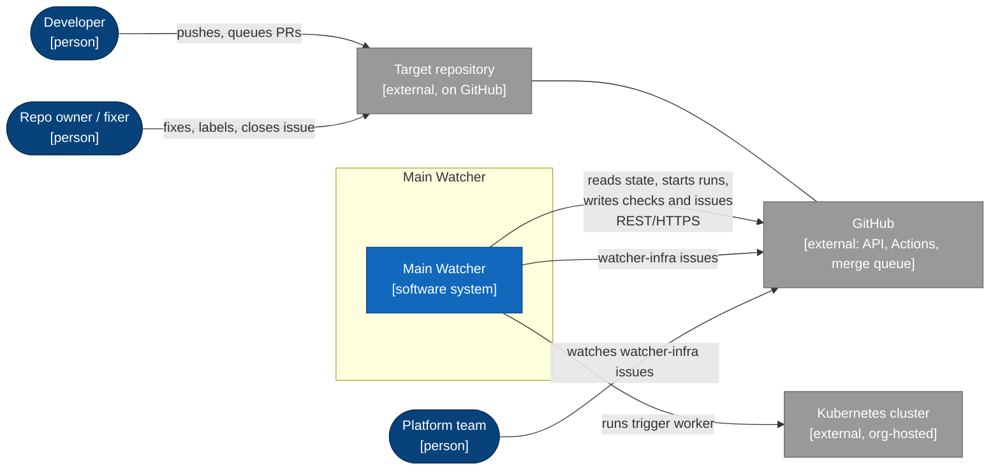
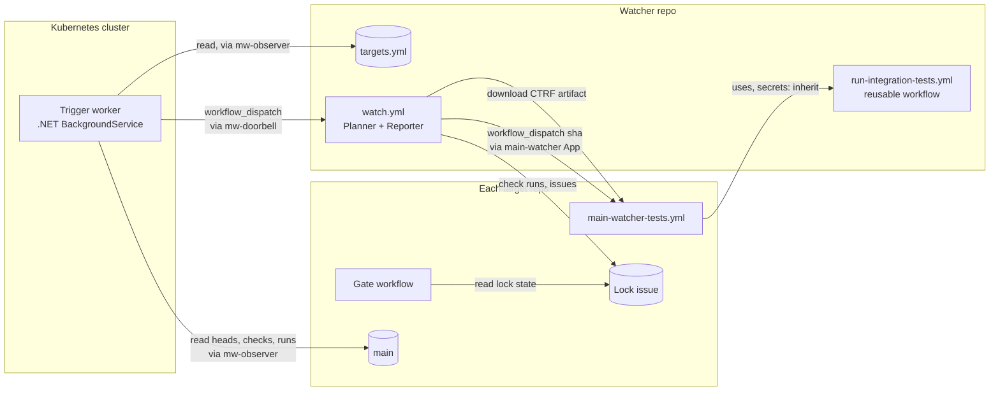
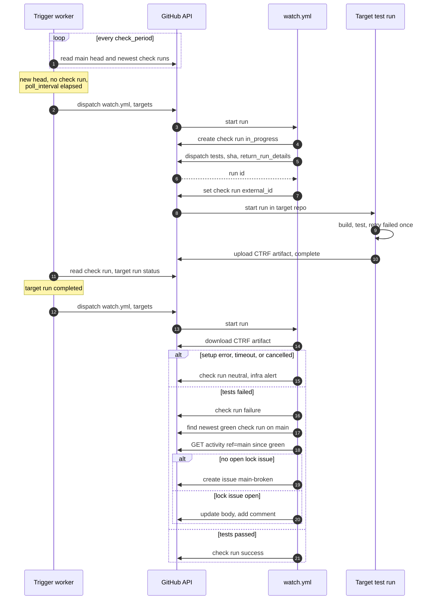
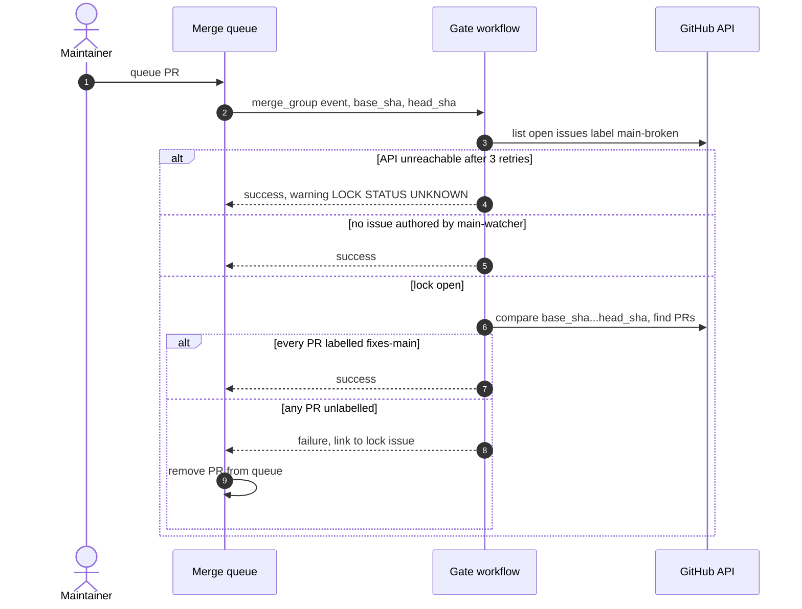
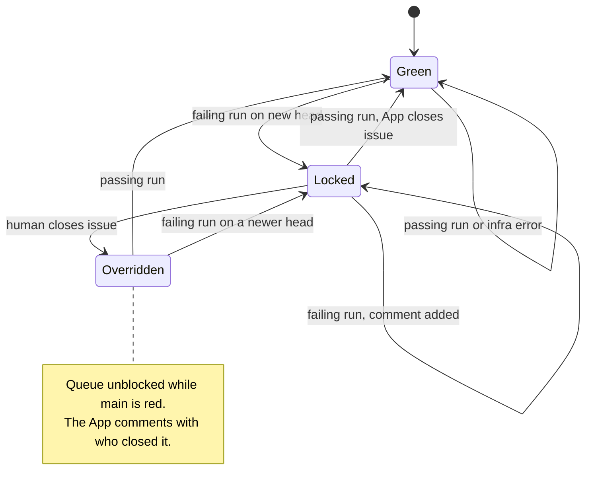
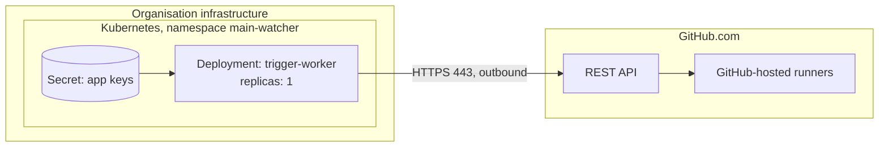

# Main Watcher — Architecture

## Confirmation queue

These items started as defaults chosen during design. The requester settled them all on
2026-09-15.

| # | Item | Section | Why it matters | Settled by |
|---|---|---|---|---|
| CQ-1 | Each target has a configurable `poll_interval` (default 15 min): the minimum time between test starts. The worker checks for changes every `check_period` (default 60 s). Confirmed | 2, 5.1 | Detection time vs. test load | Requester |
| CQ-2 | All target repos live in the watcher's GitHub organisation. Confirmed | 8, 10 | One installation per App | Requester |
| CQ-3 | Each target repo manages its own test secrets, its own way. Confirmed; this became FR-5 and ADR-009 | 8 | Who controls test credentials | Requester |
| CQ-4 | Failed tests are retried once before a failure counts. Confirmed | 5.1 | Flaky tests would otherwise lock the queue | Requester |
| CQ-5 | Setup, checkout and timeout errors alert, but do **not** lock the queue. Confirmed | 5.1, 11 | Watcher faults must not block teams | Requester |
| CQ-6 | The issue @-mentions owners only: `notify` in `targets.yml`, else the `*` owners in CODEOWNERS. Confirmed | 5.1 | Notification noise | Requester |
| CQ-7 | The gate fails **open** on API errors; the watcher reports it afterwards (ADR-008). Confirmed | 5.2, 11 | Merge availability | Requester |
| CQ-8 | The platform team owns the watcher repo, the trigger worker and all three GitHub Apps. Confirmed | 14 | Key custody | Requester |
| CQ-9 | Anyone with triage rights may apply `fixes-main`. Confirmed | 8, R-4 | The lock bypass | Requester |

---

## 1. Overview

Main Watcher is a reusable component that continuously runs a repository's .NET/xUnit v3
integration tests against the latest commit on `main`.

When tests fail, it opens a GitHub issue listing the failing tests and every push made to
`main` since the last green run. While that issue is open, the repository's GitHub merge
queue is blocked. The only PRs that can still merge are those labelled `fixes-main`.

It has four parts:

- **The trigger worker** — a small .NET service in the organisation's Kubernetes cluster.
  Every minute it checks, read-only, whether any target has a new `main` head or a finished
  test run. If so, it starts the watcher workflow. GitHub's own scheduler is too unreliable
  for this job (ADR-010).
- **The watcher repo** — decides what to test, starts the test workflow in each target,
  and reports results. It acts through the `main-watcher` GitHub App (ADR-001).
- **A test workflow in each target repo** — calls a shared, versioned workflow from the
  watcher repo. Because it runs inside the target repo, it uses that repo's own secrets
  (ADR-009).
- **A gate workflow in each target repo** — a required merge-queue check that fails queue
  entries while a lock issue is open (ADR-002). If it cannot reach the API it fails open,
  and the watcher reports any merges that slipped through (ADR-008).

Every test run also reports timings: suite duration, build vs. test time, and the slowest
tests across recent runs. These appear in the run's job summary and on the commit's check
(ADR-011). A metrics store of the organisation's own is deferred.

Main Watcher has no datastore; GitHub holds all state (ADR-003):
- the lock is the open issue;
- the test outcome for each commit is a check run;
- the link to a running test is stored on that check run.

## 2. Drivers

| Driver | Type | Source | Consequence for the design |
|---|---|---|---|
| FR-1 Reusable; can be pointed at any GitHub repo | Fact | Requester | Onboarding = config entry + two workflow files + App installs |
| FR-2 Runs integration tests continuously on `main`, testing only the latest commit when pushes pile up | Fact | Requester | Change detection by the worker; one run per target at a time (ADR-001, ADR-010) |
| FR-3 On failure, opens an issue listing failing tests and all pushes since the last successful run | Fact | Requester | CTRF results (ADR-007); repository activity API |
| FR-4 Blocks the GitHub merge queue until the issue is resolved | Fact | Requester | Gate check (ADR-002); resolution rules (ADR-004) |
| FR-5 Each target repo manages its tests' secrets its own way | Fact | Requester, 2026-09-15 | Tests run inside the target repo (ADR-009) |
| FR-6 Capture how long integration tests take, and identify the slowest tests in a suite | Fact | Requester, 2026-09-15 | Timings and reports in the shared workflow (ADR-011); own store deferred |
| C-1 GitHub's merge queue has no pause function | Constraint | Community discussion 50893; vendor comparison | Pause built from a required check |
| C-2 While `main` is locked, a fix must still be able to merge | Constraint | Design analysis | `fixes-main` bypass |
| C-3 "Restrict updates" ruleset bypass lists reportedly don't work | Risk-bearing fact (user reports) | Community discussions 113172, 196766 | Freeze ruleset rejected (ADR-002) |
| C-4 The only queue in use is GitHub's own merge queue | Constraint | Requester | No Mergify adapter |
| C-5 Every target repo uses .NET with xUnit v3 | Constraint | Requester | CTRF contract (ADR-007) |
| C-6 .NET shop; no Azure subscription; containers can be hosted on Docker/Kubernetes | Constraint | Requester, 2026-09-15 | Self-hosted worker (ADR-010) |
| C-8 No monitoring, alerting or database infrastructure exists | Constraint | Requester, 2026-09-15 | Alerts via GitHub issues (ADR-012); metrics phase 1 stays inside GitHub (ADR-011) |
| C-7 GitHub scheduled workflows are delayed and sometimes dropped | Fact | GitHub troubleshooting docs; requester experience | The schedule is only a backup sweep (ADR-010) |
| NFR-1 Time from a bad push to an open issue ≤ `poll_interval` + suite duration + about 2 × `check_period` | Assumption | Derived | About 17 min plus suite time with defaults, while the worker is healthy |
| NFR-2 A healthy `main` adds no delay to merges | Decision | D2 discussion | The gate decides locally |
| NFR-3 Neither a watcher/worker outage nor a GitHub API error blocks merges | Decision | Requester | Fail-open by construction (ADR-008) |
| NFR-4 Every merge of an unlabelled PR during a lock is reported | Decision | Requester | Reconciliation (ADR-008) |

### Quality attributes, in priority order

| Rank | Attribute | Target and conditions | How it will be verified |
|---|---|---|---|
| 1 | Correctness of the lock | Main is never locked without an App-authored issue, and never stays locked after a green run | TS-S3–S6 |
| 2 | Availability of merging | No component outage blocks merges; a false lock can be overridden in under 5 min | TS-S7, TS-S9 |
| 3 | Least privilege | The worker holds only read and dispatch rights; target code never runs near the main App key | TS-S8 |
| 4 | Timeliness | NFR-1 while the worker is healthy; at most about 1 h + suite time while it is down | TS-S11, alert timestamps |
| 5 | Cost | No GitHub Actions run when nothing changed | Actions usage report |

### Assumptions

| # | Assumption | Impact if wrong | Owner | Confirm by |
|---|---|---|---|---|
| A-1 | Fewer than 20 target repos | Worker API usage and dispatch volume grow; revisit ADR-010 | Platform lead | 2026-10-15 |
| A-2 | Test suites finish in under 30 minutes | Slower detection; more superseded commits | Platform lead | Onboarding |
| A-4 | Target test workflows run on GitHub-hosted runners, or on self-hosted runners the target team owns | None for the watcher; isolation is the target team's concern | Target owners | Onboarding |
| A-5 | The merge-group payload's `base_sha`/`head_sha` identify every PR in a group | The gate cannot enforce grouped merges | Platform lead | Sandbox, before rollout |
| A-6 | The cluster has outbound HTTPS to `api.github.com` and a secret store (no alerting stack; see C-8) | The worker cannot run there | Platform team | Before build |

### Scope

**In scope:**
- testing the latest `main` commit of each configured repo;
- the lock issue's lifecycle;
- the gate;
- the trigger worker;
- onboarding documentation.

**Out of scope:**
- PR-branch testing;
- automatic re-queueing of PRs the gate removed (§17);
- non-GitHub merge queues;
- bisecting to find the culprit commit (§17);
- webhook-driven triggering (§17).

### Domains considered

| Domain | Status |
|---|---|
| Context/scope, structure, governance | In play |
| Integration (GitHub APIs) | In play; critical |
| Identity and security | In play; §8. No separate threat model |
| Runtime, observability, deployment | In play: a self-hosted worker now exists (§10, §11) |
| Quality and testing | In play; TS-001 |
| Data | Light; GitHub holds all state |
| Performance and scale | Set aside because of A-1; rate limits are tracked as R-13 |
| Delivery and teams | Set aside because of CQ-8 |
| Migration | Set aside; this is new work |
| Cost | Light; Actions minutes run only when there is work |

## 3. System context

This diagram answers: who interacts with Main Watcher, and what does it depend on?

**GitHub is critical.** When its API is down:
- the worker and the watcher retry, then give up without changing any lock (CQ-5);
- the gate fails open (ADR-008), and the watcher reports any harm afterwards.

**The Kubernetes cluster matters for timeliness, not correctness.** While the worker is
down, the hourly sweep still does the work (ADR-010).

## 4. Solution overview

This diagram answers: what are the pieces, where do they run, and who calls whom?

| Container | Responsibility | Technology | Owner | Serves |
|---|---|---|---|---|
| targets.yml | Lists targets: repo, test command, CTRF results glob, timeout, `poll_interval`, `notify`, `enabled` | YAML in watcher repo | Platform team | FR-1 |
| Trigger worker | Every `check_period`, detects work per target (new head, finished run, stale run) and starts `watch.yml`. Exposes `/healthz`. Raises `watcher-infra` issues if the watcher hasn't completed a run in 2 h, on repeated errors, or on token failures (ADR-012) | .NET 8+ `BackgroundService`, container, 1 replica | Platform team | FR-2, C-7 |
| watch.yml — Planner | For the targets passed in (or all, on the hourly sweep): creates an in-progress check run, starts the target's test workflow with `return_run_details`, stores the run ID in the check run's `external_id`. Handles stale runs; reconciles merges made during a lock (ADR-008); raises "worker appears down" if work waited more than 15 min | GitHub Actions job | Platform team | FR-2, NFR-4 |
| watch.yml — Reporter | For completed target runs: downloads CTRF, completes the check run, finds the last green commit, collects pushes, and opens, updates or closes the lock issue. Adds a timing section to the check run: suite time, change from last green, 5 slowest tests, retry flag (ADR-011) | GitHub Actions job | Platform team | FR-3, FR-4 |
| run-integration-tests.yml | `test` job: checks out `sha`, restores and builds, runs tests with one retry of failed tests, writes `timings.json`, uploads the `main-watcher-ctrf` artifact. `report` job: no secrets, read-only token, publishes the CTRF job summary with the slowest tests and duration trends (ADR-011) | Reusable GitHub workflow, version-tagged; `ctrf-io/github-test-reporter` pinned by SHA | Platform team | FR-2, FR-6, ADR-007 |
| main-watcher-tests.yml | Caller: `workflow_dispatch` inputs → reusable workflow, `secrets: inherit`. The place where the target sets up OIDC or feeds | ~15-line workflow in target | Target owners (template from platform) | FR-5 |
| Gate workflow | On `merge_group`: fails while an App-authored lock is open, unless every PR in the group has `fixes-main`. Fails open, with a warning, on API errors. On `pull_request`: always passes | ~40-line workflow in target | Target owners (template from platform) | FR-4, C-2 |
| main | The branch under test | Git branch | Target owners | FR-2 |
| Lock issue | The pause signal and the human report | Issue labelled `main-broken`, authored by `main-watcher[bot]` | Target owners | FR-3, FR-4 |
| GitHub Apps | `main-watcher` (acts), `mw-observer` (reads), `mw-doorbell` (starts `watch.yml`, raises alert issues) | GitHub Apps | Platform team | §8 |

## 5. Key flows

### 5.1 Push → test → lock (FR-2, FR-3, FR-4)

This diagram answers: what happens between a bad push and a blocked queue?

**Latest only.** While a target has an in-progress check run, the worker flags no new
head for it. When the run completes, the next cycle tests whatever `main` is at that
moment; intermediate commits are never tested.

**Failure behaviour.**

- **Target run cancelled, deleted, or never started.**
  - Detection: the check run stays `in_progress`, or its `external_id` points to a run that
    finished without an artifact.
  - Once older than the target's timeout + 10 min, it is marked `neutral`.
  - A `watcher-infra` alert is raised, and the current head is retested.
- **Duplicate `watch.yml` runs.** Harmless: a concurrency group keeps one pending run, and
  a head that already has a check run is never started twice.
- **Worker down.** The hourly sweep at minute 17 processes all targets. If it finds work
  older than 15 minutes, it raises "trigger worker appears down" (ADR-010).
- **No green run exists yet, or the green commit was force-pushed away.** The push list
  falls back to activity after the green check run's timestamp, or to the last 100
  pushes. The issue says which fallback was used.
- **Non-zero exit without valid CTRF.** The issue says "failing tests unknown" and links to
  the target run (ADR-007).
- **Duplicate reporters.** The Reporter looks for an existing open, App-authored
  `main-broken` issue before creating one. `watch.yml` concurrency serialises Reporters.

**Issue content:**

- **Body (current state):**
  - the failing commit;
  - the failing tests (name, suite, first line of `message`, truncated to 200 chars);
  - a link to the target run;
  - a push table: time, pusher (plain name, no `@`), type (push / force push / PR merge /
    merge-queue merge), before→after, commit count;
  - hidden markers `<!-- main-watcher last_green=… first_red=… last_reconciled=… -->`.
- **Comments (history):** one per later failing run. Comments do not mention anyone.
- **Mentions (CQ-6):** the body opens by mentioning the target's `notify` list, or else the
  owners of the `*` rule in CODEOWNERS. If neither exists, nobody is mentioned, and a
  `watcher-infra` warning asks for `notify` to be configured.

### 5.2 Merge group while locked (FR-4, C-2, ADR-008)

This diagram answers: how does the gate block ordinary PRs but let fixes through?

**Notes:**
- **Only App-authored issues lock the queue.**
- **On `pull_request` events the gate always passes.**
- **PRs removed by the gate** must be re-queued by hand (§17). The unlock comment lists
  them.
- **Reconciliation.** Every merge moves `main`, which makes the worker start `watch.yml`.
  For each locked target, the Planner lists `merge_queue_merge` and `pr_merge` activity
  since `last_reconciled`. Any PR merged without `fixes-main` is appended under "Merged
  while locked" and raised as a `watcher-infra` alert.

### 5.3 Resolution (ADR-004)

This diagram answers: what states can a target be in, and what moves it between them?

## 6. Data

Main Watcher has no datastore.

| Data | System of record | Derived copies | Classification | Retention |
|---|---|---|---|---|
| Target list | `targets.yml` in watcher repo | Worker's in-memory copy per cycle | Internal | Git history |
| Test outcome per commit | Check run by `main-watcher` on target commit | Lock issue text | Internal | GitHub check retention |
| Link to running test | Check run `external_id` = target run ID | — | Internal | As above |
| Lock state | Open App-authored `main-broken` issue | — | Internal | Issue history |
| Last green commit, last reconciled activity | Check runs; hidden markers in the lock issue | — | Internal | As above |
| Test logs, CTRF reports | Actions run and artifact **in the target repo** | Excerpts in the issue | Internal; may contain secrets if tests print them | Target repo's artifact retention |
| Test timings (`timings.json`: queue wait, step durations, wall time, summed test time, retry flag) | `main-watcher-ctrf` artifact in the target repo | Job summary; check run output | Internal | Target repo's artifact retention; phase 2 store deferred (ADR-011) |

## 8. Security

**Trust boundaries:**
- **Target code** runs only in the target repo's own Actions runs, under that repo's
  secrets and permissions (ADR-009). It never runs in the watcher repo or in the cluster.
- **The trigger worker** runs in the organisation's cluster and holds only read and
  dispatch credentials (ADR-010).
- **The main App key** exists only in the watcher repo's `reporter` environment, used only
  by `watch.yml`, which executes no target code.

**GitHub Apps:**

| App | Installed on | Permissions | Key location | Worst case if the key leaks |
|---|---|---|---|---|
| `main-watcher` | Targets | Metadata R, Contents R, Checks W, Issues W, Actions W | Watcher `reporter` environment | Fake or close locks; start, cancel or disable target workflows (R-11) |
| `mw-observer` | Targets + watcher | Metadata R, Contents R, Checks R, Actions R | Kubernetes Secret | Read-only access to target code and run metadata |
| `mw-doorbell` | Watcher only | Actions W, Issues W | Kubernetes Secret | Start, cancel or disable watcher workflows; create spam issues in the watcher repo (R-12) |

**Report job permissions (in the target's run):** `actions: read`, `contents: read`. It has
no secret references, and the third-party reporter action is pinned by commit SHA (R-16).

**Gate workflow permissions:** `issues: read`, `pull-requests: read`, `contents: read`.

**Secrets inventory:**

| Secret | Stored in | Managed by |
|---|---|---|
| `main-watcher` private key | Watcher repo, `reporter` environment | Platform team |
| `mw-observer` and `mw-doorbell` private keys | Kubernetes Secret, or the cluster's secret store | Platform team |
| Anything the tests need (DB strings, feed tokens, OIDC trust) | The target repo, its own way (FR-5) | Target owners |

For cloud access from tests, targets should prefer OIDC (`id-token: write`) over stored
keys. That is a recommendation, not something the watcher enforces.

**Permission matrix:**

| Principal | Target code | Checks | Lock issue | Target workflows | Merge queue |
|---|---|---|---|---|---|
| Trigger worker | Read | Read | — | Read status | — |
| watch.yml | Read | Write | Create, update, close | Start, read artifacts | — |
| Target test run | Read, execute | — | — | (itself) | — |
| Gate workflow | Read | Its own | Read | — | Pass/fail entries |
| Maintainer (triage+) | per repo | — | Close (override) | per repo | Apply `fixes-main` |

**Organisation setting:** the watcher repo must allow its reusable workflows to be used by
other repositories in the organisation.

**Audit:** check runs, issue events, label events, workflow run history, and the worker's
logs.

## 9. Integrations

| Dependency | Owner | Criticality | Interaction | On failure |
|---|---|---|---|---|
| GitHub REST API: commits, check runs, issues, compare | GitHub | Critical | Sync REST, App tokens | Retry with backoff; no lock change |
| Workflow dispatch API with `return_run_details` (Feb 2026) | GitHub | Critical for testing | Sync REST | Retry on the next cycle. Fallback if the run ID is missing: find the run by the `sha` input (R-14) |
| Actions artifacts API | GitHub | Critical for reporting | Sync REST | Treat as "failing tests unknown" after retries |
| Repository activity API | GitHub | Degraded: push list only | Sync REST | Issue opens with "push list unavailable" and a compare link |
| GitHub scheduled events | GitHub | Backup only | Hourly cron | The worker is the primary trigger |
| GitHub merge queue + rulesets | GitHub | Critical for FR-4 | Required check on `merge_group` | Outside our control |
| Kubernetes cluster | Organisation | Degraded: timeliness | Hosting | Liveness restart; hourly sweep + "worker appears down" issue alert |
| `ctrf-io/github-test-reporter` action | Open-source project | Degraded: timing report only | Step in the `report` job | Tests and locking are unaffected; the job summary is missing |

All GitHub calls go through one adapter per codebase: `GitHubGateway` in the worker, and
`github.ts` in the watcher scripts.

## 10. Deployment

This diagram answers: what runs where, and over which connections?

**Trigger worker:**
- A container image built from the worker project and published to the organisation's
  registry.
- Deployed with a Helm chart or plain manifests: one replica, liveness probe `/healthz`,
  resource requests of about 50m CPU and 128Mi memory `[assumption]`.
- It needs no inbound network access.
- A single replica is enough because duplicate dispatches are harmless. More replicas
  would need leader election (ADR-010).

**Watcher repo:**
- Changes go through PRs.
- The reusable workflow and the templates are tagged (`v1`, `v2`), and targets pin a tag.

**Rollback:**
- Worker: redeploy the previous image tag.
- Workflows: revert the commit or move the tag.
- A single target: set `enabled: false` in `targets.yml`.

**Onboarding a repo:**
1. Add an entry to `targets.yml`.
2. Install `main-watcher` and `mw-observer` on the repo.
3. Add `main-watcher-tests.yml` and the gate workflow from their templates, and set up the
   tests' secrets in the repo.
4. Make the gate a required check in the repo's merge-queue ruleset.
5. Trigger one run manually. Confirm that a check run appears and the CTRF artifact
   validates against the schema.
6. Run sandbox scenario TS-S5 once.

## 11. Cross-cutting concerns

**Observability:**

| Signal | Source | Alert goes to |
|---|---|---|
| 3 worker cycle errors in a row | Worker | `watcher-infra` issue (ADR-012) |
| No completed `watch.yml` run in 2 h | Worker check | `watcher-infra` issue (ADR-012) |
| Hung worker | Kubernetes liveness probe | Automatic restart |
| "Trigger worker appears down" (work waited more than 15 min) | Hourly sweep | `watcher-infra` issue |
| Infrastructure error twice in a row for a target; stale or cancelled target run | Planner | `watcher-infra` issue |
| PR merged without `fixes-main` during a lock (ADR-008) | Planner | `watcher-infra` issue + lock issue |
| `gate-fail-open` check runs | Hourly sweep | `watcher-infra` issue |
| Missing `notify` and CODEOWNERS | Reporter | `watcher-infra` issue |
| App token failures | Worker / watcher | `watcher-infra` issue |

All alerts arrive as de-duplicated `watcher-infra` issues in the watcher repo. The platform
team subscribes to that label.

**Test-duration metrics (FR-6, ADR-011):**
- **Per run:** the job summary shows the slowest tests (top 10 by average across up to 100
  previous runs), duration trends and flaky rates.
- **Per commit:** the check run shows suite time, change from the last green run, and the
  5 slowest tests.
- **Measurement rules:**
  - wall-clock and summed per-test time are reported separately, because of xUnit's
    parallel execution;
  - retried runs are flagged;
  - "slowest" means across runs.
- **Not available in phase 1:** cross-repo views and slowdown alerts.

**Failing safe:**
- No component failure creates a lock.
- The gate fails open (ADR-008).
- A human can always close the lock issue (ADR-004).

**Cost:**
- GitHub Actions runs only when there is work: one short `watch.yml` run per test start or
  finish, plus 24 sweeps a day.
- Test minutes are billed to each target repo, within the same organisation.
- The worker makes about 2–3 read calls per target per minute (R-13).

## 13. Technology and versions

| Technology | Used for | Version | Upgrade owner |
|---|---|---|---|
| .NET | Trigger worker | .NET 8 LTS or later `[assumption]` | Platform team |
| Octokit.NET or plain `HttpClient` | Worker GitHub calls | Pinned | Platform team |
| Docker / Kubernetes | Worker hosting | Organisation standard | Platform team |
| GitHub Actions | watch.yml, reusable test workflow, gate | `ubuntu-latest` runners | Platform team |
| Node.js + Octokit, or a .NET script | watch.yml Planner and Reporter | Node 22 LTS `[assumption]` | Platform team |
| `actions/create-github-app-token` | Token minting in workflows | Pinned by commit SHA | Platform team |
| xUnit v3 | Test framework in all targets | v3 | Target owners |
| CTRF | Test result contract | CTRF JSON schema | Platform team |
| `ctrf-io/github-test-reporter` | Job-summary timing reports | v1, pinned by commit SHA | Platform team |

## 14. Ownership

| Asset | Owns | Operates | Approves change |
|---|---|---|---|
| Watcher repo, three Apps and their keys, trigger worker | Platform team | Platform team | Platform lead |
| `targets.yml` entry | Target owners | Platform team | Platform team + target owner |
| Test caller workflow, test secrets, gate workflow, ruleset | Target owners | GitHub | Target repo admin |
| Lock issues | Target owners | Main Watcher | — |

## 15. Decisions

| ADR | Decision | Status | Review trigger |
|---|---|---|---|
| ADR-001 | Central watcher tests only the newest `main` commit | Accepted, amended by ADR-009 and ADR-010 | More than 20 targets |
| ADR-002 | Pause the merge queue with a gate workflow in each target repo, bypassed by `fixes-main` | Accepted, amended by ADR-008 | GitHub ships a native queue pause |
| ADR-003 | No datastore; check runs and the lock issue hold all state | Accepted | Walk-back above ~50 calls |
| ADR-004 | Green run closes the lock automatically; a human close is an override | Accepted | Frequent overrides |
| ADR-005 | Test script contract: exit code plus JUnit XML | Superseded by ADR-007 | — |
| ADR-006 | GitHub App identity with split tokens | Superseded by ADR-009 | — |
| ADR-007 | Test script contract: exit code plus CTRF JSON | Accepted | A non-xUnit-v3 target appears |
| ADR-008 | Gate fails open on API errors; the watcher reconciles merges made during a lock | Accepted | More than one unlabelled merge during a lock per quarter |
| ADR-009 | Tests run as a workflow in each target repo, started by the watcher | Accepted | Security rejects `actions: write` on targets |
| ADR-010 | Self-hosted .NET trigger worker; GitHub schedule only as an hourly backup | Accepted, amended by ADR-012 | Webhook hosting becomes available |
| ADR-011 | Test-duration metrics phase 1 in GitHub (job summary, check run, `timings.json`); own store deferred | Accepted | Need for cross-repo views or alerts |
| ADR-012 | The worker alerts through `watcher-infra` GitHub issues | Accepted | A monitoring stack is adopted |

## 16. Risks and open questions

| # | Risk or question | Impact | Likelihood | Mitigation / default | Owner |
|---|---|---|---|---|---|
| R-1 | Flaky tests lock the queue for no reason | High | Medium | One retry (CQ-4); override; track flake rate per test | Target owners |
| R-2 | Gate blocks while the watcher is broken | High | Low | Only App-authored issues lock; faults never create locks (CQ-5) | Platform team |
| R-3 | Batched merge groups let a non-fix PR merge alongside a fix | Medium | Medium | Gate checks every PR in the group; sandbox test (A-5) | Platform team |
| R-4 | `fixes-main` is misused to bypass the lock | Medium | Low | Label events audited; reviews still apply (CQ-9) | Target owners |
| R-5 | Worker and hourly sweep both fail silently | Detection stops | Low | Liveness restart; worker missing-run issue; sweep "worker appears down" issue | Platform team |
| R-6 | Tests leak secrets into logs or issue text | Secret exposure | Low | Log masking; issue shows at most 200 chars of the first message line | Target owners |
| R-7 | PRs removed by the gate are forgotten after unlock | Slower delivery | High | Unlock comment lists them; automatic re-queue deferred | Platform team |
| R-8 | During an API outage, a non-fix PR merges onto a red `main` | Breakage worsens | Low | Reconciliation reports it (ADR-008) | Platform team |
| R-10 | An App's team @-mention may not notify the team | Owners miss the lock | Medium | Sandbox TS-S10; fallback: mention members (needs `members: read`) | Platform team |
| R-11 | `actions: write` lets the main App cancel or disable target workflows | Misuse if the key leaks | Low | Key only in a protected environment; the App's actions are audited; rotate the key | Platform team |
| R-12 | Doorbell key leak lets an attacker cancel or disable watcher workflows | Detection stops | Low | Key in a cluster secret with restricted access; the sweep's alert fires if runs are disabled; rotate the key | Platform team |
| R-13 | Worker API usage grows with the number of targets | Rate limiting | Low at <20 targets | Worker logs remaining rate limit and raises an issue below 20%; conditional requests (ETags) `[recommendation]` | Platform team |
| R-14 | The dispatch API does not return run details (API version change) | Runs cannot be linked | Low | Fallback: find the run by the `sha` input and dispatch time | Platform team |
| R-15 | A target team weakens its own test workflow | False green | Low | Accepted: the team owns its repo; the reusable workflow is pinned | Target owners |
| R-16 | The third-party reporter action is compromised | Tampered summaries; reads of repo contents | Low | SHA pin; secret-free job; read-only token; update only after review | Platform team |
| R-17 | CTRF durations are shown in the wrong unit by the reporter (an open issue on that project) | Misleading timing data | Medium | Sandbox check TS-S13; the check-run section uses our own conversion | Platform team |
| R-18 | Timing history is lost beyond artifact retention before phase 2 exists | Long-term trends unavailable | High | Accepted for phase 1; phase 2 can backfill only as far as retention allows | Platform lead |

## 17. Evolution

**Deferred decisions:**

| Decision | Trigger to revisit |
|---|---|
| Automatic re-queue of PRs the gate removed | R-7 complaints from more than 2 teams |
| Bisecting to name the culprit commit | Median suspect range above 5 pushes |
| Webhook receiver instead of polling (ADR-010 option C) | Public HTTPS hosting becomes available, or R-13 materialises |
| Worker leader election, multiple replicas | The worker's availability becomes a complaint |
| Metrics phase 2: PostgreSQL + Grafana fed by the worker; 90-day raw per-test rows plus permanent daily summaries (ADR-011) | Need for cross-repo views, slowdown alerts, or history beyond retention |
| Monitoring/alerting stack for the worker | The organisation adopts one (ADR-012) |

## 19. Glossary

| Term | Meaning |
|---|---|
| Target | A repository Main Watcher tests |
| Trigger worker | The self-hosted .NET service that detects work and starts `watch.yml` |
| Sweep | The hourly scheduled run of `watch.yml` that processes all targets |
| Green / red | The latest Main Watcher check run on a commit succeeded / failed |
| Lock issue | An open `main-broken` issue authored by the App; its presence blocks the merge queue |
| Override | A human closing the lock issue while `main` is still red |
| Gate | The required merge-queue check in the target that enforces the lock |

## 20. Change log

| Date | Change | By | Affected decisions |
|---|---|---|---|
| 2026-09-15 | Initial proposal | Platform team with Claude | ADR-001 to ADR-006 |
| 2026-09-15 | Result contract changed to CTRF; confirmation queue renumbered C-n → CQ-n | Platform team with Claude | ADR-007 supersedes ADR-005 |
| 2026-09-15 | CQ-1, CQ-5, CQ-7 settled; gate fails open with reconciliation | Platform team with Claude | ADR-008 amends ADR-002 |
| 2026-09-15 | CQ-2, CQ-4, CQ-6, CQ-8, CQ-9 settled; owner-only mentions | Platform team with Claude | — |
| 2026-09-15 | FR-5: targets own their test secrets; tests move into target repos; self-hosted trigger worker replaces the GitHub schedule; deployment diagram added; A-3 and R-9 removed | Platform team with Claude | ADR-009 (amends ADR-001, supersedes ADR-006), ADR-010 (amends ADR-001) |
| 2026-09-15 | FR-6 test-duration metrics (phase 1); C-8 no monitoring/DB infrastructure; A-6 corrected; worker alerts moved to GitHub issues; R-16–R-18 added | Platform team with Claude | ADR-011; ADR-012 (amends ADR-010) |
